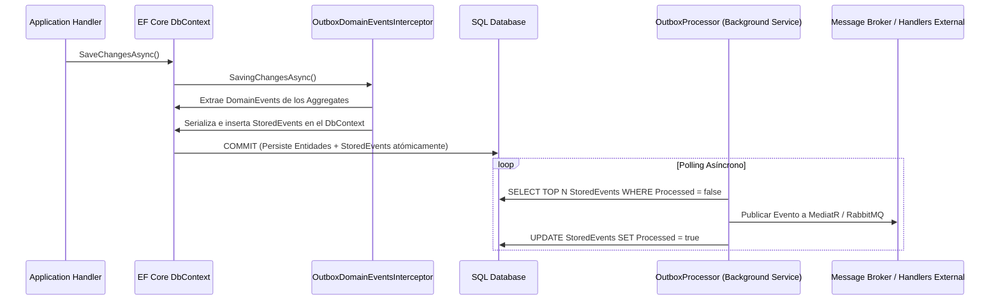

# Módulo 4: Event-Driven Architecture (EDA) y Outbox Pattern en EF Core

> **Perspectiva del Tactical DDD Modeler:** *Los eventos de dominio son hechos inmutables que representan algo ocurrido en el pasado. Se definen en voz pasiva (`PagoAutorizado`, `PrestamoAprobado`) y no llevan sufijos técnicos innecesarios.*

---

## 📡 1. Definición Estandarizada de Eventos de Dominio

Un **Evento de Dominio** captura un hecho relevante del negocio que ya ha sucedido.

### Contrato Base en `SharedKernel`

```csharp
namespace Core.SharedKernel.Domain.Events;

public interface IDomainEvent
{
    Guid EventId { get; }
    DateTimeOffset OccurredOn { get; }
}

// Record abstracto base para evitar código repetitivo de inicialización de IDs y fechas
public abstract record DomainEvent : IDomainEvent
{
    public Guid EventId { get; init; } = Guid.NewGuid();
    public DateTimeOffset OccurredOn { get; init; } = DateTimeOffset.UtcNow;
}
```

### Evento de Dominio Concreto en el Bounded Context `Prestamos`

```csharp
namespace Core.Prestamos.Domain.Events;

public sealed record PagoAutorizadoEvent(
    PrestamoId PrestamoId,
    MovimientoId MovimientoId,
    Dinero Monto,
    CodigoCobranza CodigoCobranza,
    Periodo Periodo,
    DesgloseProcesado ResultadoCalculo
) : DomainEvent;
```

---

## 🔒 2. El Problema de la Escritura Dual y la Solución Outbox Pattern

Cuando un Handler modifica una entidad en base de datos y publica un evento en un Message Broker, existe el riesgo de inconsistencia si una de las dos operaciones falla (**Dual-Write Problem**).

El **Outbox Pattern** resuelve esto interceptando los eventos acumulados en el `AggregateRoot` y guardándolos en la tabla `StoredEvents` **dentro de la misma transacción de la base de datos**.



---

## 🛠️ 3. Interceptor Transparente de EF Core (`OutboxDomainEventsInterceptor.cs`)

```csharp
namespace Persistence.Outbox;

public sealed class OutboxDomainEventsInterceptor(
    IDomainEventCollector eventCollector
) : SaveChangesInterceptor
{
    public override async ValueTask<InterceptionResult<int>> SavingChangesAsync(
        DbContextEventData eventData, 
        InterceptionResult<int> result,
        CancellationToken cancellationToken = default)
    {
        var dbContext = eventData.Context;
        if (dbContext is null) return await base.SavingChangesAsync(eventData, result, cancellationToken);
        
        // 1. Extraer los Aggregates modificados que contienen eventos
        var aggregates = eventCollector.GetAggregates()
            .Where(x => x.DomainEvents.Count != 0)
            .ToList();
        
        if (aggregates.Count == 0) return await base.SavingChangesAsync(eventData, result, cancellationToken);
        
        var domainEvents = aggregates
            .SelectMany(x => x.DomainEvents)
            .ToList();

        // 2. Transformar a StoredEvent (Entidad de Persistencia)
        var storedEvents = domainEvents
            .Select(domainEvent => new StoredEvent(
                domainEvent.EventId,
                domainEvent.GetType().AssemblyQualifiedName!,
                JsonSerializer.Serialize(domainEvent, domainEvent.GetType())
            )).ToList();
        
        // 3. Agregar los eventos a la transacción actual de EF Core
        await dbContext.Set<StoredEvent>().AddRangeAsync(storedEvents, cancellationToken);
        
        // 4. Limpiar los eventos acumulados en los Aggregates
        foreach (var aggregate in aggregates)
        {
            aggregate.ClearDomainEvents();
            eventCollector.Clear();
        }
        
        return await base.SavingChangesAsync(eventData, result, cancellationToken);
    }
}
```

---

## 📌 Puntos Clave para la Presentación

1. **Invariante de Nombres**: Los eventos expresan hechos pasados reales del negocio (`PagoAutorizadoEvent`).
2. **Garantía At-Least-Once**: El Outbox Pattern asegura que ningún evento se pierda por fallas de red o caídas del servidor.
3. **Desacoplamiento Absoluto**: El dominio no conoce RabbitMQ, Kafka ni servicios de mensajería.
