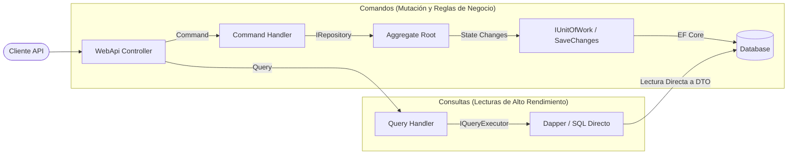

# Módulo 5: Arquitectura Hexagonal y Pipeline CQRS

> **Perspectiva del Architectural Linter:** *La capa de Dominio NUNCA hace referencia a librerías de infraestructura (EF Core, ASP.NET Core, MediatR). Todos los flujos controlados retornan el patrón `Response<T>` en lugar de lanzar excepciones para control de flujo.*

---

## 🔷 1. Invariantes de la Arquitectura Hexagonal (Puertos y Adaptadores)

```text
               +---------------------------------------------------+
               |               CONTROLADORES / HTTP                |
               +-------------------------+-------------------------+
                                         | (Inbound Adapter)
                                         v
               +-------------------------+-------------------------+
               |        PUERTOS DE ENTRADA (Inbound Ports)         |
               |        IRequest<T> / IRequestHandler<T, R>        |
               +-------------------------+-------------------------+
                                         |
                                         v
+----------------------------------------+----------------------------------------+
|                                  CAPA DE APLICACIÓN                             |
|                                (CQRS Pipeline Behaviors)                        |
|                                                                                 |
|   +-------------------------------------------------------------------------+   |
|   |                            DOMINIO CENTRAL                              |   |
|   |         (Aggregates, Value Objects, Domain Services, Events)            |   |
|   +-------------------------------------------------------------------------+   |
+----------------------------------------+----------------------------------------+
                                         |
                                         v
               +-------------------------+-------------------------+
               |        PUERTOS DE SALIDA (Outbound Ports)         |
               |     IRepository<T>, IUnitOfWork, IQueryExecutor   |
               +-------------------------+-------------------------+
                                         | (Outbound Adapter)
                                         v
               +-------------------------+-------------------------+
               |        PERSISTENCIA EF CORE / SQL / FILES         |
               +---------------------------------------------------+
```

---

## 🚫 2. Regla Anti-Excepciones para Control de Flujo

Lanzar excepciones (`throw new Exception()`) para validaciones de negocio predecibles es una mala práctica que degrada el rendimiento y contamina la pila de llamadas (*stack trace*).

En su lugar, los Handlers de Aplicación utilizan el **Result Pattern** (`Response<T>`) para comunicar el éxito o fracaso tipado:

```csharp
namespace Core.Prestamos.Application.Features.Pagos.Commands.RegistrarPago;

public class RegistrarPagoCommandHandler(
    IPrestamoRepository prestamoRepository,
    IEstadoCuentaRepository estadoCuentaRepository,
    IUnitOfWork unitOfWork
) : ICommandHandler<RegistrarPagoCommand, Unit>
{
    public async Task<Response<Unit>> Handle(RegistrarPagoCommand request, CancellationToken cancellationToken)
    {
        var id = new PrestamoId(request.PrestamoId);
        var prestamo = await prestamoRepository.GetByIdAsync(id, cancellationToken);
        if (prestamo is null)
            return Response.NotFound<Unit>($"No se encontró el préstamo con ID '{request.PrestamoId}'.");

        var estadoCuenta = await estadoCuentaRepository.GetByIdAsync(id, cancellationToken);
        if (estadoCuenta is null)
            return Response.NotFound<Unit>($"No se encontró el estado de cuenta para el préstamo '{request.PrestamoId}'.");

        // Lógica de negocio encapsulada en Agregados y Domain Services...
        prestamoRepository.Update(prestamo);
        
        await unitOfWork.SaveChangesAsync(cancellationToken);
        return Response.NoContent("Pago registrado y autorizado exitosamente.");
    }
}
```

---

## ⚡ 3. Pipeline CQRS Ligero (Validation Behavior)

El pipeline de la capa de aplicación ejecuta comportamientos transversales (*Cross-Cutting Concerns*) como la validación mediante `ValidationBehavior`:

```csharp
namespace Core.SharedKernel.Behaviors;

public class ValidationBehavior<TRequest, TResponse>(
    IEnumerable<IValidator<TRequest>> validators
) : IPipelineBehavior<TRequest, TResponse>
    where TRequest : IRequest<TResponse>
{
    public async Task<TResponse> Handle(
        TRequest request, 
        RequestHandlerDelegate<TResponse> next, 
        CancellationToken cancellationToken)
    {
        if (!validators.Any()) return await next();

        var context = new ValidationContext<TRequest>(request);
        var failures = validators
            .Select(v => v.Validate(context))
            .SelectMany(result => result.Errors)
            .Where(f => f != null)
            .ToList();

        if (failures.Count != 0)
        {
            var errorsMap = failures
                .GroupBy(e => e.PropertyName)
                .ToDictionary(g => g.Key, g => g.Select(e => e.ErrorMessage).ToArray());

            throw new BadHttpRequestException("La validación de la solicitud ha fallado.");
        }

        return await next();
    }
}
```

---

## 🔄 4. CQRS Asimétrico: Lectura vs Escritura



---

## 📌 Puntos Clave para la Presentación

1. **Aislamiento Total de Puertos**: El Dominio define qué interfaces necesita (`IRepository`, `IQueryExecutor`); Infrastructure se encarga de implementarlas.
2. **Response Pattern vs Throwing Exceptions**: Manejo de errores de negocio mediante respuestas tipadas explícitas (`Response<T>`).
3. **Lecturas Optimizadas**: CQRS permite consultas ultra-rápidas mediante SQL directo sin sobrecarga de Change Tracking de EF Core.
