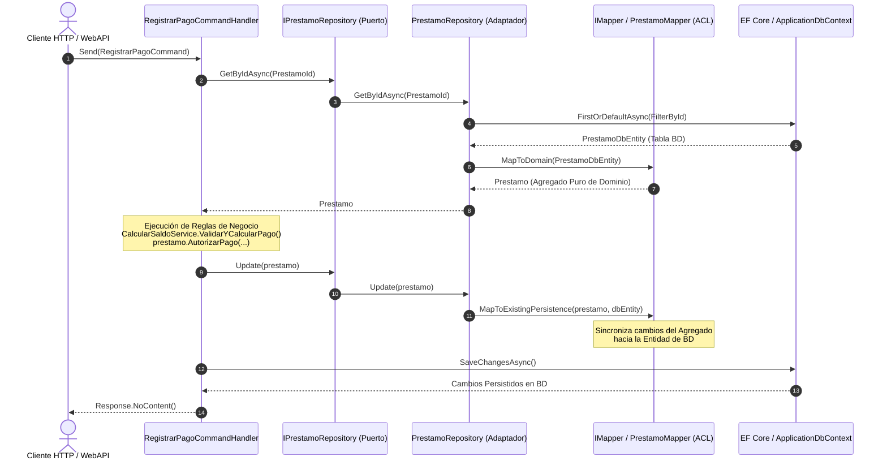

# Flujo Real de Arquitectura Hexagonal y Capa Anticorrupción (ACL) en .NET

> **Nota de Arquitectura:** Este documento refleja la **implementación real del repositorio**, conectando los componentes desde la abstracción de Dominio (`SharedKernel`), pasando por el Caso de Uso en Aplicación (`Core.Prestamos`), hasta la Capa Anticorrupción (ACL) y los Adaptadores Secundarios en Persistencia (`Persistence`).

---

## 🏛️ 1. Definición del Puerto de Dominio Base (`SharedKernel`)

En el `SharedKernel`, la interfaz `IRepository<TAggregate, TId>` establece el contrato genérico para cualquier Raíz de Agregado (*Aggregate Root*). Junto a `IUnitOfWork`, define los límites transaccionales de persistencia sin acoplarse a ninguna tecnología ORM (como EF Core o Dapper).

### 📄 [`Core/SharedKernel/Domain/IRepository.cs`](file:///var/home/goodgus/Documents/Github/DDD-Templates/templates/dotnet/Core/SharedKernel/Domain/IRepository.cs)

```csharp
namespace Core.SharedKernel.Domain;

public interface IRepository<TAggregate, in TId>
    where TAggregate : AggregateRoot<TId>
    where TId : notnull
{
    Task<TAggregate?> GetByIdAsync(TId id, CancellationToken cancellationToken = default);
    void Add(TAggregate aggregate);
    void Update(TAggregate aggregate);
    void Remove(TAggregate aggregate);
    Task<TAggregate?> FindSingleAsync(ISpecification<TAggregate> spec, CancellationToken cancellationToken = default);
    Task<IEnumerable<TAggregate>> FindAsync(ISpecification<TAggregate> spec,
        CancellationToken cancellationToken = default);
}

public interface IUnitOfWork
{
    Task<int> SaveChangesAsync(CancellationToken cancellationToken = default);
}
```

---

## 🎯 2. Puerto de Dominio Concreto (`Bounded Context`)

### ⚠️ Regla de Arquitectura: Anti-Patrón de Repositorio Genérico en Handlers
Inyectar `IRepository<Prestamo, PrestamoId>` directamente en los Handlers de Aplicación es un **anti-patrón**. Se debe definir un puerto explícito dentro del Bounded Context (`IPrestamoRepository`) para mantener el Lenguaje Ubicuo y permitir la extensión de métodos de consulta específicos del dominio.

### 📄 [`Core/Prestamos/Domain/Ports/IPrestamoRepository.cs`](file:///var/home/goodgus/Documents/Github/DDD-Templates/templates/dotnet/Core/Prestamos/Domain/Ports/IPrestamoRepository.cs)

```csharp
using Core.Prestamos.Domain.Model.Prestamo;
using Core.SharedKernel.Domain;

namespace Core.Prestamos.Domain.Ports;

public interface IPrestamoRepository : IRepository<Prestamo, PrestamoId>;
```

---

## ⚡ 3. Caso de Uso Concreto en Aplicación (`RegistrarPagoCommand`)

El Handler de Aplicación actúa como **Orquestador**. No contiene lógica de negocio intrínseca; delega la validación de dominio a las Raíces de Agregado (`Prestamo`, `EstadoCuenta`) y Domain Services (`CalcularSaldoService`), interactuando únicamente a través de los Puertos declarados (`IPrestamoRepository`, `IEstadoCuentaRepository`, `IUnitOfWork`).

### 📄 [`Core/Prestamos/Application/Features/Pagos/Commands/RegistrarPago/RegistrarPagoCommand.cs`](file:///var/home/goodgus/Documents/Github/DDD-Templates/templates/dotnet/Core/Prestamos/Application/Features/Pagos/Commands/RegistrarPago/RegistrarPagoCommand.cs)

```csharp
using Core.Prestamos.Domain.Enums;
using Core.Prestamos.Domain.Model.EstadoCuenta.Movimientos;
using Core.Prestamos.Domain.Model.Prestamo;
using Core.Prestamos.Domain.Ports;
using Core.Prestamos.Domain.Services;
using Core.Prestamos.Domain.ValueObjects;
using Core.SharedKernel.Application.Mediator;
using Core.SharedKernel.Application.Wrappers;
using Core.SharedKernel.Domain;
using Core.SharedKernel.ValueObjects;

namespace Core.Prestamos.Application.Features.Pagos.Commands.RegistrarPago;

public record RegistrarPagoCommand(
    int PrestamoId,
    int MovimientoId,
    decimal MontoDepositado,
    string CodigoCobranza,
    string Descripcion,
    EfectoContable EfectoContable,
    string Periodo
) : IRequest<Unit>;

public class RegistrarPagoCommandHandler(
    IPrestamoRepository prestamoRepository,
    IEstadoCuentaRepository estadoCuentaRepository,
    IUnitOfWork unitOfWork
) : ICommandHandler<RegistrarPagoCommand, Unit>
{
    public async Task<Response<Unit>> Handle(RegistrarPagoCommand request, CancellationToken cancellationToken)
    {
        var id = new PrestamoId(request.PrestamoId);
        var prestamo = await prestamoRepository.GetByIdAsync(id, cancellationToken);
        if (prestamo is null)
            return Response.NotFound<Unit>($"No se encontró el préstamo con ID '{request.PrestamoId}'.");

        var estadoCuenta = await estadoCuentaRepository.GetByIdAsync(id, cancellationToken);
        if (estadoCuenta is null)
            return Response.NotFound<Unit>($"No se encontró el estado de cuenta para el préstamo '{request.PrestamoId}'.");

        var monto = new Dinero(request.MontoDepositado);
        var periodo = Periodo.Parse(request.Periodo, prestamo.Condiciones.Periodicidad);
        var codigo = new CodigoCobranza(request.CodigoCobranza, request.Descripcion, request.EfectoContable);
        var movimientoId = new MovimientoId(request.MovimientoId);

        // 1. Usar Domain Service para validar y calcular el prorrateo pre-autorización
        var resultadoCalculo = CalcularSaldoService.ValidarYCalcularPago(prestamo, estadoCuenta, monto, periodo);

        // 2. Upstream Prestamo autoriza el pago y emite el PagoAutorizadoEvent
        prestamo.AutorizarPago(movimientoId, monto, codigo, periodo, resultadoCalculo);
        prestamoRepository.Update(prestamo);

        // 3. Persistir cambios (el evento de dominio actualizará EstadoCuenta a través de PagoAutorizadoEventSubscriber)
        await unitOfWork.SaveChangesAsync(cancellationToken);

        return Response.NoContent("Pago registrado y autorizado exitosamente.");
    }
}
```

---

## 🛡️ 4. Capa Anticorrupción (ACL) y Adaptadores en Persistencia (`Persistence`)

La Capa Anticorrupción (ACL) aísla el Modelo de Dominio de la estructura de tablas y limitaciones del ORM (Entity Framework Core).

### 4.1 Contrato del Mapeador ACL (`IMapper<TDomain, TPersistence>`)

#### 📄 [`Persistence/Mappers/IMapper.cs`](file:///var/home/goodgus/Documents/Github/DDD-Templates/templates/dotnet/Persistence/Mappers/IMapper.cs)

```csharp
namespace Persistence.Mappers;

/// <summary>
/// Define el contrato estricto de la Capa Anticorrupción (ACL), forzando una barrera 
/// bidireccional entre los modelos de la infraestructura de datos y las entidades puras de negocio.
/// </summary>
public interface IMapper<TDomain, TPersistence>
{
    TDomain MapToDomain(TPersistence persistence);
    TPersistence MapToPersistence(TDomain domain);
    void MapToExistingPersistence(TDomain domain, TPersistence persistence);
}
```

---

### 4.2 Entidad de Persistencia (POCO acoplado al ORM / Database)

Modelo de datos relacional para EF Core.

#### 📄 `Persistence/Entities/PrestamoDbEntity.cs`

```csharp
namespace Persistence.Entities;

public class PrestamoDbEntity
{
    public int Id { get; set; }
    public int BeneficiarioId { get; set; }
    public decimal SaldoPendiente { get; set; }
    public string Moneda { get; set; } = "USD";
    public string OrigenConcepto { get; set; } = string.Empty;
    public string? OrigenFolio { get; set; }
    public int PeriodicidadId { get; set; }
    public decimal TasaInteres { get; set; }
    public int PlazoMeses { get; set; }
    public string EstadoCodigo { get; set; } = string.Empty;
}
```

---

### 4.3 Mapeador ACL Concreto (`PrestamoMapper`)

Implementa `IMapper<Prestamo, PrestamoDbEntity>`. Traduce los Value Objects (`Dinero`, `PrestamoId`, `BeneficiarioId`, `OrigenApertura`, `CondicionesOriginales`) y patrones de Estado a primitivos de BD y viceversa.

#### 📄 `Persistence/Mappers/PrestamoMapper.cs`

```csharp
using Core.Prestamos.Domain.Model.Beneficiario;
using Core.Prestamos.Domain.Model.Prestamo;
using Core.Prestamos.Domain.ValueObjects;
using Core.SharedKernel.ValueObjects;
using Persistence.Entities;

namespace Persistence.Mappers;

public class PrestamoMapper : IMapper<Prestamo, PrestamoDbEntity>
{
    public Prestamo MapToDomain(PrestamoDbEntity persistence)
    {
        var id = new PrestamoId(persistence.Id);
        var beneficiarioId = new BeneficiarioId(persistence.BeneficiarioId);
        var condiciones = new CondicionesOriginales(
            (Periodicidad)persistence.PeriodicidadId,
            new TasaInteres(persistence.TasaInteres),
            new PlazoMeses(persistence.PlazoMeses)
        );
        var capitalInicial = new Dinero(persistence.SaldoPendiente, persistence.Moneda);

        // Reconstitución pura del Agregado de Dominio a través de sus métodos de fábrica
        var prestamo = Prestamo.NuevoPrestamo(id, beneficiarioId, condiciones, capitalInicial);
        
        return prestamo;
    }

    public PrestamoDbEntity MapToPersistence(Prestamo domain)
    {
        var entity = new PrestamoDbEntity();
        MapToExistingPersistence(domain, entity);
        return entity;
    }

    public void MapToExistingPersistence(Prestamo domain, PrestamoDbEntity persistence)
    {
        persistence.Id = domain.Id.Value;
        persistence.BeneficiarioId = domain.BeneficiarioId.Value;
        persistence.SaldoPendiente = domain.SaldoPendiente.Monto;
        persistence.Moneda = domain.SaldoPendiente.Moneda;
        persistence.OrigenConcepto = domain.Origen.Concepto;
        persistence.OrigenFolio = domain.Origen.Folio;
        persistence.PeriodicidadId = (int)domain.Condiciones.Periodicidad;
        persistence.TasaInteres = domain.Condiciones.TasaInteres.Valor;
        persistence.PlazoMeses = domain.Condiciones.PlazoMeses.Valor;
        persistence.EstadoCodigo = domain.Estado.GetType().Name;
    }
}
```

---

### 4.4 Repositorio Genérico de Infraestructura (`GenericRepository`)

Implementación base que encapsula el filtrado, la extracción de llaves primarias y la invocación transparente del mapeador ACL (`IMapper`).

#### 📄 [`Persistence/Repository/GenericRepository.cs`](file:///var/home/goodgus/Documents/Github/DDD-Templates/templates/dotnet/Persistence/Repository/GenericRepository.cs)

```csharp
using System.Linq.Expressions;
using Microsoft.EntityFrameworkCore;
using Core.SharedKernel.Domain;
using Core.SharedKernel.Domain.Events;
using Persistence.Mappers;

namespace Persistence.Repository;

public abstract class GenericRepository<TAggregate, TId, TPersistence, TContext>(
    TContext dbContext,
    IMapper<TAggregate, TPersistence> mapper,
    IDomainEventCollector eventCollector
) : IRepository<TAggregate, TId>
    where TAggregate : AggregateRoot<TId>
    where TPersistence : class
    where TContext : DbContext
    where TId : notnull
{
    private readonly DbSet<TPersistence> _dbSet = dbContext.Set<TPersistence>();

    protected abstract object[] ExtractPrimaryKeyValues(TId id);
    protected virtual IQueryable<TPersistence> OnConfigureHydration(IQueryable<TPersistence> query) => query;
    protected abstract Expression<Func<TPersistence, bool>> FilterById(TId id);

    public virtual async Task<TAggregate?> GetByIdAsync(TId id, CancellationToken cancellationToken = default)
    {
        IQueryable<TPersistence> query = _dbSet.AsQueryable();
        query = OnConfigureHydration(query);
        
        var persistence = await query.FirstOrDefaultAsync(FilterById(id), cancellationToken);
        return persistence == null ? null : mapper.MapToDomain(persistence);
    }

    public virtual void Add(TAggregate aggregate)
    {
        eventCollector.AddAggregate(aggregate);
        var persistence = mapper.MapToPersistence(aggregate);
        _dbSet.Add(persistence);
    }

    public virtual void Update(TAggregate aggregate)
    {
        eventCollector.AddAggregate(aggregate);
        var key = ExtractPrimaryKeyValues(aggregate.Id);
        var persistenceEntity = _dbSet.Find(key);

        if (persistenceEntity == null)
            throw new InvalidOperationException(
                $"No se pudo encontrar la entidad de persistencia para el Agregado {typeof(TAggregate).Name} con ID {aggregate.Id}");

        mapper.MapToExistingPersistence(aggregate, persistenceEntity);
    }

    public virtual void Remove(TAggregate aggregate)
    {
        eventCollector.AddAggregate(aggregate);
        var key = ExtractPrimaryKeyValues(aggregate.Id);
        var persistenceEntity = _dbSet.Find(key);
        if (persistenceEntity != null)
        {
            dbContext.Set<TPersistence>().Remove(persistenceEntity);
        }
    }

    public virtual async Task<TAggregate?> FindSingleAsync(ISpecification<TAggregate> spec,
        CancellationToken cancellationToken = default)
    {
        var query = BuildSpecificationQuery(spec);
        var persistence = await query.SingleOrDefaultAsync(cancellationToken);
        return persistence == null ? null : mapper.MapToDomain(persistence);
    }

    public virtual async Task<IEnumerable<TAggregate>> FindAsync(ISpecification<TAggregate> spec,
        CancellationToken cancellationToken = default)
    {
        var query = BuildSpecificationQuery(spec);
        var results = await query.ToListAsync(cancellationToken);
        return results.Select(mapper.MapToDomain);
    }

    private IQueryable<TPersistence> BuildSpecificationQuery(ISpecification<TAggregate> spec)
    {
        var query = _dbSet.AsQueryable();
        query = OnConfigureHydration(query);
        query = ApplySpecification(query, spec);
        return query;
    }

    protected virtual IQueryable<TPersistence> ApplySpecification(IQueryable<TPersistence> query,
        ISpecification<TAggregate> spec) => query;
}
```

---

### 4.5 Adaptador de Persistencia Concreto (`PrestamoRepository`)

Hereda de `GenericRepository` e implementa la interfaz de puerto `IPrestamoRepository`.

#### 📄 `Persistence/Repository/PrestamoRepository.cs`

```csharp
using System.Linq.Expressions;
using Core.Prestamos.Domain.Model.Prestamo;
using Core.Prestamos.Domain.Ports;
using Core.SharedKernel.Domain.Events;
using Persistence.Context;
using Persistence.Entities;
using Persistence.Mappers;

namespace Persistence.Repository;

public class PrestamoRepository(
    ApplicationDbContext dbContext,
    IMapper<Prestamo, PrestamoDbEntity> mapper,
    IDomainEventCollector eventCollector
) : GenericRepository<Prestamo, PrestamoId, PrestamoDbEntity, ApplicationDbContext>(dbContext, mapper, eventCollector),
    IPrestamoRepository
{
    protected override object[] ExtractPrimaryKeyValues(PrestamoId id) => [id.Value];

    protected override Expression<Func<PrestamoDbEntity, bool>> FilterById(PrestamoId id)
    {
        return p => p.Id == id.Value;
    }
}
```

---

## 🔄 5. Flujo de Ejecución Arquitectónico (Diagrama Mermaid)



---

## 📌 Puntos Clave para la Arquitectura

1. **Aislamiento Absoluto de Dominio (`Core/`)**: El modelo de dominio (`Prestamo`) no contiene ni atributos de EF Core (`DataAnnotations`), ni constructores vacíos requeridos por el ORM, ni setters públicos.
2. **Capa Anticorrupción (`IMapper`)**: Toda la complejidad de mapear tablas planas a objetos de valor complejos y raíces de agregado encapsuladas reside exclusivamente en `Persistence/Mappers`.
3. **Inversión de Dependencias (DIP)**: `RegistrarPagoCommandHandler` depende únicamente de la interfaz `IPrestamoRepository` definida en Dominio, desconociendo por completo si la persistencia es EF Core, Dapper o MongoDB.
