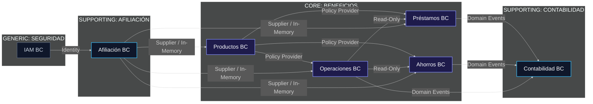
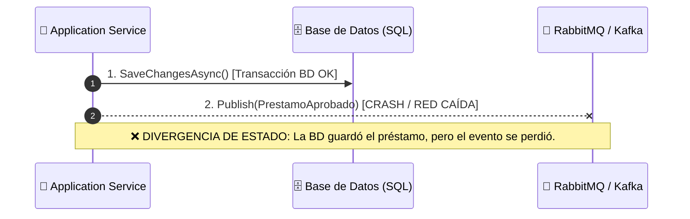
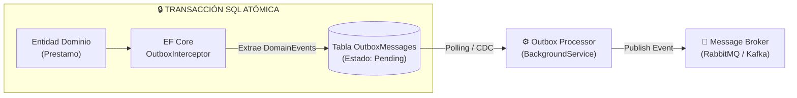
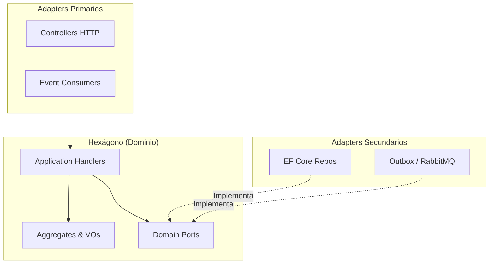

# DDD Avanzado & Arquitectura Hexagonal
## De la Teoría Táctica a la Implementación Limpia en C# .NET 10

<div class="mt-6 flex gap-3 items-center">
  <span class="badge badge-primary">Arquitectura Enterprise</span>
  <span class="badge badge-success">C# 14 / .NET 10</span>
  <span class="badge badge-warning">DDD Táctico & Estratégico</span>
</div>

<div class="mt-8 p-6 glass-card max-w-2xl">
  <p class="text-sm leading-relaxed text-slate-300">
    Un recorrido práctico sobre diseño de software robusto aplicado a sistemas reales de 
    <strong class="text-sky-400">Beneficios, Préstamos, Ahorros, Operaciones, Afiliación y Contabilidad</strong>.
  </p>
</div>

<div @click="$slidev.nav.next" class="mt-8 py-2 px-5 inline-flex items-center gap-2 rounded-lg cursor-pointer bg-sky-500/20 border border-sky-500/40 hover:bg-sky-500/30 transition text-sm text-sky-300 font-semibold">
  <span>Iniciar Presentación</span>
  <carbon:arrow-right />
</div>

---
transition: fade-out
layout: two-cols-header
---

# 1. El Puente Arquitectónico
## Del Conocimiento Básico al DDD Enterprise

::left::

<div class="glass-card mr-2 mt-2 h-full flex flex-col justify-between border-l-4 border-l-red-500">
  <div>
    <span class="badge badge-danger mb-3">⚠️ El Problema Habitual</span>
    <ul class="text-xs space-y-3 leading-relaxed text-slate-300 mt-2">
      <li><strong>Anemia en el Dominio:</strong> Entidades reducidas a meros DTOs con getters/setters públicos indeseados.</li>
      <li><strong>Lógica dispersa:</strong> Validaciones críticas filtradas en controladores HTTP o Application Services.</li>
      <li><strong>Acoplamiento a Infraestructura:</strong> Dependencias directas de EF Core o SDKs de mensajería en el modelo.</li>
      <li><strong>Dual-Write Frágil:</strong> Intentar guardar en BD y publicar en RabbitMQ en la misma petición web.</li>
    </ul>
  </div>
</div>

::right::

<div class="glass-card ml-2 mt-2 h-full flex flex-col justify-between border-l-4 border-l-emerald-500">
  <div>
    <span class="badge badge-success mb-3">🛡️ El Enfoque Senior de Hoy</span>
    <ul class="text-xs space-y-3 leading-relaxed text-slate-300 mt-2">
      <li><strong>Screaming Architecture:</strong> El código refleja el negocio, no el framework.</li>
      <li><strong>Invariantes Incondicionales:</strong> Constructores privados, Factory Methods y *Design by Contract*.</li>
      <li><strong>Fronteras con ACL:</strong> Aislamiento defensivo entre Bounded Contexts vía *Anti-Corruption Layer*.</li>
      <li><strong>Outbox Pattern:</strong> Persistencia atómica de eventos de dominio con interceptores de EF Core.</li>
    </ul>
  </div>
</div>

---
transition: slide-left
layout: default
---

# 2. Screaming Architecture & Subdominios
## Delimitación Estratégica del Sistema de Beneficios

<div class="grid grid-cols-3 gap-5 mt-6">

<div class="glass-card border-t-4 border-t-amber-400">
  <div class="flex items-center justify-between mb-3">
    <h3 class="text-amber-400 font-bold text-base">🎯 CORE DOMAINS</h3>
    <span class="badge badge-warning">Núcleo</span>
  </div>
  <p class="text-xs text-slate-400 mb-3 font-medium">Lógica diferenciadora del negocio</p>
  <ul class="text-xs space-y-2 text-slate-300">
    <li><strong>📦 Productos BC:</strong> Políticas, tasas, accesorios y comisiones.</li>
    <li><strong>📊 Préstamos BC:</strong> Amortización, intereses moratorios y devengados.</li>
    <li><strong>💰 Ahorros BC:</strong> Captación, cuentas, prelación de retiros y rendimientos.</li>
    <li><strong>⚙️ Operaciones BC:</strong> Orquestación de refinanciamientos y ampliaciones.</li>
  </ul>
</div>

<div class="glass-card border-t-4 border-t-sky-400">
  <div class="flex items-center justify-between mb-3">
    <h3 class="text-sky-400 font-bold text-base">📋 SUPPORTING</h3>
    <span class="badge badge-primary">Soporte</span>
  </div>
  <p class="text-xs text-slate-400 mb-3 font-medium">Capacidades de apoyo especializado</p>
  <ul class="text-xs space-y-2.5 text-slate-300">
    <li><strong>👥 Afiliación BC:</strong> Ciclo de vida y estado de afiliados.</li>
    <li><strong>⚖️ Contabilidad BC:</strong> Enteros bancarios y dispersión PAG.</li>
  </ul>
</div>

<div class="glass-card border-t-4 border-t-slate-400">
  <div class="flex items-center justify-between mb-3">
    <h3 class="text-slate-300 font-bold text-base">🔑 GENERIC</h3>
    <span class="badge bg-slate-700 text-slate-200">Infra</span>
  </div>
  <p class="text-xs text-slate-400 mb-3 font-medium">Capacidad transversal reutilizable</p>
  <ul class="text-xs space-y-2.5 text-slate-300">
    <li><strong>🔒 IAM BC:</strong> Autenticación, tokens JWT, roles y auditoría de accesos al sistema.</li>
  </ul>
</div>

</div>

---
transition: slide-up
layout: default
---

# 3. Context Map & Relaciones Upstream / Downstream
## Visión General del Sistema de Beneficios

<div class="mermaid-scrollable">



</div>

<div class="mt-2 text-xs text-slate-400 text-center italic">
  💡 Desplaza horizontalmente para explorar el diagrama completo a tamaño real.
</div>

---
transition: slide-left
layout: two-cols-header
---

# 4. Estrategias de Integración entre Contextos
## Relaciones entre Equipos y Modelos de Dominio

::left::

<div class="glass-card mr-2 mt-2 space-y-3 text-xs leading-relaxed text-slate-300">
  <h3 class="text-sky-400 font-bold text-sm mb-2">🔗 Clasificación Upstream / Downstream</h3>
  <div class="p-2.5 rounded bg-slate-900/60 border border-slate-800">
    <strong class="text-amber-300">Upstream (U) / Downstream (D):</strong><br>
    El contexto Upstream dicta el contrato o emite eventos; el Downstream consume y se adapta.
  </div>
  <div class="p-2.5 rounded bg-slate-900/60 border border-slate-800">
    <strong class="text-sky-300">Customer-Supplier:</strong><br>
    El equipo Upstream atiende las necesidades de integración del Downstream con prioridad.
  </div>
  <div class="p-2.5 rounded bg-slate-900/60 border border-slate-800">
    <strong class="text-emerald-300">Published Language (PL):</strong><br>
    Contratos DTO inmutables y compartidos (ej. eventos en `SharedKernel`).
  </div>
</div>

::right::

<div class="glass-card ml-2 mt-2 space-y-3 text-xs leading-relaxed text-slate-300">
  <h3 class="text-purple-400 font-bold text-sm mb-2">🛡️ Patrones Tácticos de Integración</h3>
  <div class="p-2.5 rounded bg-slate-900/60 border border-slate-800">
    <strong class="text-purple-300">Anti-Corruption Layer (ACL):</strong><br>
    Traductor defensivo que evita que modelos o DTOs externos contaminen el Core Domain.
  </div>
  <div class="p-2.5 rounded bg-slate-900/60 border border-slate-800">
    <strong class="text-pink-300">Conformist Pattern:</strong><br>
    El Downstream acepta el esquema Upstream cuando este es estable y estándar.
  </div>
  <div class="p-2.5 rounded bg-slate-900/60 border border-slate-800">
    <strong class="text-indigo-300">Shared Kernel:</strong><br>
    Código compartido strictly acotado a Value Objects agnósticos (ej. `Dinero.cs`).
  </div>
</div>

---
transition: slide-left
layout: default
---

# 5. Anti-Corruption Layer (ACL) en C# 14
## Aislando el Dominio de Préstamos del Contexto de Productos

El contexto de **Préstamos** requiere reglas del contexto de **Productos**, pero NUNCA debe acoplarse a los DTOs externos.

```csharp {all|2-7|9-18|20-29}
// 1. Contrato de la Capa Anticorrupción (ACL) en Persistence/Mappers/IMapper.cs
public interface IMapper<TDomain, TPersistence>
{
    TDomain MapToDomain(TPersistence persistence);
    TPersistence MapToPersistence(TDomain domain);
    void MapToExistingPersistence(TDomain domain, TPersistence persistence);
}

// 2. Mapeador ACL Concreto: Traduce de PrestamoDbEntity (BD) a Prestamo (Dominio)
public class PrestamoMapper : IMapper<Prestamo, PrestamoDbEntity>
{
    public Prestamo MapToDomain(PrestamoDbEntity persistence)
    {
        var id = new PrestamoId(persistence.Id);
        var beneficiarioId = new BeneficiarioId(persistence.BeneficiarioId);
        var origen = new OrigenApertura(persistence.OrigenConcepto, persistence.OrigenFolio);
        var saldoPendiente = new Dinero(persistence.SaldoPendiente, persistence.Moneda);
        var estado = MapearEstadoDesdeCodigo(persistence.EstadoCodigo);

        // RECONSTITUCIÓN PURA: Llama a Prestamo.Reconstruir(...) desde la BD 
        // ¡NUNCA ejecuta reglas de "Nuevo Préstamo" ni re-emite eventos de dominio duplicados!
        return Prestamo.Reconstruir(id, beneficiarioId, origen, condiciones, saldoPendiente, estado);
    }

    public void MapToExistingPersistence(Prestamo domain, PrestamoDbEntity persistence)
    {
        persistence.Id = domain.Id.Value;
        persistence.BeneficiarioId = domain.BeneficiarioId.Value;
        persistence.SaldoPendiente = domain.SaldoPendiente.Monto;
        persistence.EstadoCodigo = domain.Estado.GetType().Name;
    }
}
```

---
transition: slide-left
layout: default
---

# 6. Domain Services vs Application Services
## Responsabilidad Exacta en la Arquitectura

<div class="grid grid-cols-3 gap-4 text-xs mb-4">

<div class="glass-card border-t-2 border-t-amber-400">
  <h4 class="font-bold text-amber-400 text-sm mb-1">🧠 Domain Service</h4>
  <p class="text-slate-300">Lógica de negocio pura multientidad.</p>
  <ul class="mt-2 space-y-1 text-slate-400">
    <li>❌ Sin I/O ni dependencias de BD.</li>
    <li>❌ Sin control transaccional.</li>
    <li>✅ Algoritmos y cálculos puros.</li>
  </ul>
</div>

<div class="glass-card border-t-2 border-t-sky-400">
  <h4 class="font-bold text-sky-400 text-sm mb-1">🚀 Application Service</h4>
  <p class="text-slate-300">Orquestador del Caso de Uso.</p>
  <ul class="mt-2 space-y-1 text-slate-400">
    <li>✅ Carga Agregados vía Repositorio.</li>
    <li>✅ Invoca Domain Services.</li>
    <li>✅ Persiste vía UnitOfWork.</li>
  </ul>
</div>

<div class="glass-card border-t-2 border-t-slate-400">
  <h4 class="font-bold text-slate-300 text-sm mb-1">🔌 Infrastructure Service</h4>
  <p class="text-slate-300">Detalles de entrada / salida y HTTP.</p>
  <ul class="mt-2 space-y-1 text-slate-400">
    <li>✅ Conexión con APIs bancarias (PAG).</li>
    <li>✅ Generación de PDFs y Mails.</li>
    <li>✅ Interceptores de EF Core.</li>
  </ul>
</div>

</div>

```csharp {all|2-7}
// Domain Service Puro: Lógica de negocio multientidad sin I/O ni repositorios
public class CalcularSaldoService
{
    public static ResultadoCalculo ValidarYCalcularPago(
        Prestamo prestamo, EstadoCuenta estadoCuenta, Dinero monto, Periodo periodo)
    {
        // Validar reglas de dominio entre Agregados (Préstamo y EstadoCuenta) y retornar cálculo
        return new ResultadoCalculo(monto, periodo);
    }
}
```

---
transition: slide-left
layout: default
---

# 7. Strongly Typed IDs & Performance en C# 14
## Optimización de Memoria: `readonly record struct` vs `record`

Garantizamos seguridad de tipos sin saturar el Garbage Collector (GC):

<div class="grid grid-cols-2 gap-5 mt-4">

<div class="glass-card border-l-4 border-l-sky-400">

<div class="flex items-center justify-between mb-2">
  <h3 class="text-sky-400 font-bold text-sm">⚡ 1 Campo Primario -> struct</h3>
  <span class="badge badge-success">Zero Heap Allocation</span>
</div>

<p class="text-xs text-slate-300 mb-3">Se asigna en el Stack. Cero presión en el GC en consultas masivas.</p>

```csharp
public readonly record struct PrestamoId(Guid Value)
{
    public static PrestamoId New() => new(Guid.NewGuid());
    public static PrestamoId Empty => new(Guid.Empty);
}
```

</div>

<div class="glass-card border-l-4 border-l-purple-400">

<div class="flex items-center justify-between mb-2">
  <h3 class="text-purple-400 font-bold text-sm">🧠 Compuestos / Grandes -> record</h3>
  <span class="badge badge-primary">Pass by Reference</span>
</div>

<p class="text-xs text-slate-300 mb-3">Para llaves compuestas con metadatos. Evita copias pesadas en Stack.</p>

```csharp
public record CompositeKeyId(
    string TenantCode, 
    long SequenceId
);
```

</div>

</div>

---
transition: slide-left
layout: default
---

# 8. Value Objects Ricos & Fowler Allocation Algorithm
## Dominio Financiero sin Pérdida de Centavos en `Dinero.cs`

Los Value Objects inmutables encapsulan reglas de cálculo exacto:

```csharp {all|3-9|11-23}
public record Dinero
{
    public decimal Monto {; init; }
    public string Moneda {; init; }

    private Dinero(decimal monto, string moneda) => 
        (Monto, Moneda) = (monto >= 0 ? monto : throw new DomainException("Monto negativo"), moneda);

    public static Dinero Decimal(decimal monto, string moneda = "MXN") => new(monto, moneda);

    // Fowler Allocation Algorithm: Distribución equitativa prorrateada sin perder centavos
    public Dinero[] DistribuirProporcionalmente(int partes)
    {
        var montoBase = Math.Truncate((Monto / partes) * 100m) / 100m;
        var residuoCentavos = (int)((Monto - (montoBase * partes)) * 100m);

        var resultado = new Dinero[partes];
        for (int i = 0; i < partes; i++)
        {
            var extra = i < residuoCentavos ? 0.01m : 0.00m;
            resultado[i] = Decimal(montoBase + extra, Moneda);
        }
        return resultado;
    }
}
```

---
transition: slide-left
layout: default
---

# 9. Factory Methods & Reconstitución de Dominio
## Constructor Privado Único: `NuevoPrestamo` vs `Reconstruir`

El Agregado protege su encapsulación prohibiendo constructores públicos tradicionales:

```csharp {all|3-5|7-15|17-22}
public class Prestamo : AggregateRoot<PrestamoId>
{
    // 1. CONSTRUCTOR PRIVADO ÚNICO: Único canal de instanciación controlado
    private Prestamo(PrestamoId id, BeneficiarioId beneficiarioId, OrigenApertura origen,
                     CondicionesOriginales condiciones, Dinero saldoInicial, EstadoPrestamo estado) : base(id) { ... }

    // 2. FACTORY METHOD DE NEGOCIO (Creación Nueva desde Caso de Uso en Aplicación)
    public static Prestamo NuevoPrestamo(PrestamoId id, BeneficiarioId beneficiarioId,
                                         CondicionesOriginales condiciones, Dinero capitalInicial)
    {
        if (capitalInicial.Monto <= 0) throw new DomainException("El capital debe ser mayor a cero.");
        var prestamo = new Prestamo(id, beneficiarioId, origen, condiciones, capitalInicial, new EstadoPendiente());
        prestamo.AddDomainEvent(new PrestamoCreado(prestamo.Id, beneficiarioId, capitalInicial));
        return prestamo;
    }

    // 3. RECONSTITUCIÓN DE DOMINIO (Exclusivo para la ACL Mapper desde la Base de Datos)
    public static Prestamo Reconstruir(PrestamoId id, BeneficiarioId beneficiarioId, OrigenApertura origen,
                                        CondicionesOriginales condiciones, Dinero saldoPendiente, EstadoPrestamo estado)
    {
        return new Prestamo(id, beneficiarioId, origen, condiciones, saldoPendiente, estado);
    }
}
```

<div class="grid grid-cols-2 gap-4 mt-3 text-xs">
  <div class="glass-card border-l-4 border-l-emerald-500 p-2.5">
    <strong class="text-emerald-400">🌱 `NuevoPrestamo(...)` (Nuevas Entidades)</strong><br>
    Ejecuta invariantes actuales del negocio, asigna `EstadoPendiente` y emite `PrestamoCreado`.
  </div>
  <div class="glass-card border-l-4 border-l-sky-500 p-2.5">
    <strong class="text-sky-400">🔄 `Reconstruir(...)` (Hidratación desde BD / ACL)</strong><br>
    Restaura el estado histórico exacto. <strong>NUNCA valida de nuevo ni re-emite eventos de dominio duplicados.</strong>
  </div>
</div>

---
transition: slide-left
layout: default
---

# 10. Domain State Machine Pattern en C# 14
## Eliminando `switch/if` Spaghetti con Records Polimórficos

```csharp {all|2-5|7-12|14-19}
// Jerarquía polimórfica inmutable
public abstract record EstadoPrestamo(string Nombre)
{
    public abstract EstadoPrestamo TransicionarA(EstadoPrestamo nuevoEstado);
}

public record EstadoPendiente() : EstadoPrestamo("Pendiente")
{
    public override EstadoPrestamo TransicionarA(EstadoPrestamo nuevo) =>
        nuevo is EstadoAprobado or EstadoCancelado 
            ? nuevo 
            : throw new DomainException($"Transición inválida de Pendiente a {nuevo.Nombre}");
}

public record EstadoAprobado() : EstadoPrestamo("Aprobado")
{
    public override EstadoPrestamo TransicionarA(EstadoPrestamo nuevo) =>
        nuevo is EstadoLiquidado 
            ? nuevo 
            : throw new DomainException($"Un préstamo Aprobado solo puede pasar a Liquidado.");
}
```

---
transition: slide-left
layout: default
---

# 11. El Problema del Dual-Write & EDA
## ¿Por qué falla guardar en BD y publicar en Broker en la misma petición?

<div class="mermaid-container">



</div>

<div class="mt-3 p-3 glass-card border-l-4 border-l-red-500 flex items-center gap-3">
  <span class="badge badge-danger">Divergencia Crítica</span>
  <p class="text-xs text-slate-300 leading-relaxed">
    Publicar directamente al Message Broker tras guardar en BD no garantiza atomicidad.
    Se requiere el <strong>Outbox Pattern</strong> para garantizar consistencia eventual.
  </p>
</div>

---
transition: slide-left
layout: default
---

# 12. Arquitectura del Outbox Pattern
## Persistencia Atómica en una Única Transacción SQL

<div class="mermaid-container">



</div>

<div class="mt-3 text-xs text-slate-300 text-center">
  Los eventos se escriben en la tabla <code>OutboxMessages</code> dentro del mismo commit de la base de datos SQL.
</div>

---
transition: slide-left
layout: default
---

# 13. Interceptor de Outbox en C# 14
## `OutboxDomainEventsInterceptor.cs`

```csharp {all|3-7|10-15|17-25}
public class OutboxDomainEventsInterceptor : SaveChangesInterceptor
{
    public override ValueTask<InterceptionResult<int>> SavingChangesAsync(
        DbContextEventData eventData, InterceptionResult<int> result, CancellationToken ct = default)
    {
        var dbContext = eventData.Context;
        if (dbContext is null) return base.SavingChangesAsync(eventData, result, ct);

        // 1. Extraer Agregados con eventos de dominio pendientes
        var domainEvents = dbContext.ChangeTracker.Entries<IAggregateRoot>()
            .Select(e => e.Entity)
            .Where(e => e.DomainEvents.Any())
            .SelectMany(e => e.PopDomainEvents())
            .ToList();

        // 2. Convertir eventos en registros inmutables de Outbox
        var outboxMessages = domainEvents.Select(evt => new OutboxMessage(
            Guid.NewGuid(),
            evt.GetType().Name,
            JsonSerializer.Serialize(evt, evt.GetType()),
            DateTime.UtcNow
        ));

        dbContext.Set<OutboxMessage>().AddRange(outboxMessages);
        return base.SavingChangesAsync(eventData, result, ct);
    }
}
```

---
transition: slide-left
layout: two-cols-header
---

# 14. Arquitectura Hexagonal
## Puertos & Adaptadores en C# .NET 10

::left::

<div class="mermaid-container mr-2 mt-2">



</div>

::right::

<div class="glass-card ml-2 mt-2 space-y-3 text-xs leading-relaxed text-slate-300">
  <h3 class="text-sky-400 font-bold text-sm">📐 Principios de Inversión (DIP)</h3>
  <div class="p-2.5 rounded bg-slate-900/60 border border-slate-800">
    <strong class="text-sky-300">1. Puerto de Dominio:</strong><br>
    <code class="text-sky-300">IPrestamoRepository : IRepository&lt;Prestamo, PrestamoId&gt;</code> vive en <code class="text-slate-400">Core.Prestamos.Domain.Ports</code>.
  </div>
  <div class="p-2.5 rounded bg-slate-900/60 border border-slate-800">
    <strong class="text-amber-300">2. Adaptador Secundario:</strong><br>
    <code class="text-amber-300">PrestamoRepository</code> implementa el puerto heredando de <code class="text-slate-400">GenericRepository</code> en <code class="text-slate-400">Persistence.Repository</code>.
  </div>
  <div class="p-2.5 rounded bg-slate-900/60 border border-slate-800">
    <strong class="text-emerald-300">3. Barrera ACL Integrada:</strong><br>
    El repositorio invoca de forma transparente a <code class="text-emerald-300">IMapper&lt;Prestamo, PrestamoDbEntity&gt;</code>.
  </div>
</div>

---
transition: slide-left
layout: default
---

# 15. CQRS Asimétrico & Result Pattern (Response)
## Flujo de Control Funcional sin Excepciones Costosas

```csharp {all|2-7|10-27}
// 1. Result Pattern (Respuestas explícitas tipadas en lugar de throw new Exception)
public class Response
{
    public static Response<T> NotFound<T>(string error) => new(default, false, error);
    public static Response<Unit> NoContent(string message) => new(Unit.Value, true, message);
}

// 2. Command Handler Real (RegistrarPagoCommandHandler en Core.Prestamos)
public class RegistrarPagoCommandHandler(
    IPrestamoRepository prestamoRepository,
    IEstadoCuentaRepository estadoCuentaRepository,
    IUnitOfWork unitOfWork
) : ICommandHandler<RegistrarPagoCommand, Unit>
{
    public async Task<Response<Unit>> Handle(RegistrarPagoCommand request, CancellationToken cancellationToken)
    {
        var id = new PrestamoId(request.PrestamoId);
        var prestamo = await prestamoRepository.GetByIdAsync(id, cancellationToken);
        if (prestamo is null)
            return Response.NotFound<Unit>($"No se encontró el préstamo con ID '{request.PrestamoId}'.");

        var estadoCuenta = await estadoCuentaRepository.GetByIdAsync(id, cancellationToken);
        var resultadoCalculo = CalcularSaldoService.ValidarYCalcularPago(prestamo, estadoCuenta, monto, periodo);

        prestamo.AutorizarPago(movimientoId, monto, codigo, periodo, resultadoCalculo);
        prestamoRepository.Update(prestamo);
        await unitOfWork.SaveChangesAsync(cancellationToken);

        return Response.NoContent("Pago registrado y autorizado exitosamente.");
    }
}
```

---
transition: slide-left
layout: default
---

# 16. Event Subscribers & Límite Transaccional
## Suscriptores Delgados (*Slim Subscribers*): Evento ➔ Mapeo a Comando ➔ Mediador

> **Regla de Oro:** Un Suscriptor de Eventos **NUNCA inyecta `IRepository`, ni `DbContext`, ni `IUnitOfWork`**.
> Modificar múltiples agregados en la misma transacción viola la encapsulación. Se inyecta exclusivamente `IMediator` y se despacha un Comando.

```csharp {all|2-3|5-18}
// 1. Evento de Dominio (Expresividad en pasado sin el sufijo redundante 'Event')
public record AfiliadoDesvinculado(int AfiliadoId, DateTime FechaDesvinculacion) : DomainEvent;

// 2. Suscriptor Delgado (Decoupled Slim Subscriber - Cero acceso directo a BD)
public class AfiliadoDesvinculadoSubscriber(
    IMediator mediator // ✅ ÚNICA DEPENDENCIA PERMITIDA: Mantiene la consistencia eventual aislada
) : IDomainEventSubscriber<AfiliadoDesvinculado>
{
    public async Task Handle(AfiliadoDesvinculado domainEvent, CancellationToken cancellationToken)
    {
        // 1. Mapeo transparente desde el Evento hacia un Comando de Aplicación
        var command = new LiquidarPrestamosPorDesvinculacionCommand(domainEvent.AfiliadoId);

        // 2. Despachar el comando. El CommandHandler abrirá su propia transacción aislada.
        await mediator.Send(command, cancellationToken);
    }
}
```

---
transition: slide-left
layout: default
---

# 17. Checklist Architectural Linters
## Reglas de Oro en DDD Enterprise

<div class="grid grid-cols-2 gap-5 mt-4">

<div class="glass-card border-t-4 border-t-emerald-500">
  <div class="flex items-center gap-2 mb-3">
    <span class="badge badge-success">✅ DO'S</span>
    <h3 class="text-emerald-400 font-bold text-sm">Prácticas Obligatorias</h3>
  </div>
  <ul class="text-xs space-y-2 text-slate-300">
    <li>✔ Constructores privados (`NuevoPrestamo` creación vs `Reconstruir` hidratación).</li>
    <li>✔ Eventos de Dominio en pasado sin sufijo 'Event' (`PagoAutorizado`, `PrestamoCreado`).</li>
    <li>✔ Suscriptores Delgados: Inyectan <strong>únicamente `IMediator`</strong> y despachan Comandos.</li>
    <li>✔ Outbox Pattern para publicación atómica de Domain Events en BD.</li>
    <li>✔ Capa Anticorrupción (ACL / `IMapper`) para aislar tablas relacionales de BD.</li>
  </ul>
</div>

<div class="glass-card border-t-4 border-t-red-500">
  <div class="flex items-center gap-2 mb-3">
    <span class="badge badge-danger">❌ DON'TS</span>
    <h3 class="text-red-400 font-bold text-sm">Smells Prohibidos</h3>
  </div>
  <ul class="text-xs space-y-2 text-slate-300">
    <li>✖ Inyectar `IRepository`, `DbContext` o `IUnitOfWork` dentro de un Event Subscriber.</li>
    <li>✖ Nombrar clases con el sufijo redundante `Event` (ej. `PagoAutorizadoEvent`).</li>
    <li>✖ Entidades anémicas con setters públicos (`public set;`).</li>
    <li>✖ Lanzar excepciones para validaciones (`Response.UnprocessableEntity`).</li>
    <li>✖ `switch/if` spaghetti para manejo de estados (usar State Pattern).</li>
  </ul>
</div>

</div>

---
transition: fade-out
layout: center
class: text-center
---

# 🎯 Conclusión & Próximos Pasos

<div class="max-w-xl mx-auto p-6 glass-card text-left text-xs space-y-3 my-6">

<div class="flex items-center gap-2 text-sky-400 font-bold text-sm mb-2">
  <carbon:checkmark />
  <span>Resumen Arquitectónico</span>
</div>

<ul class="space-y-2.5 text-slate-300 list-none p-0 m-0">
  <li><strong class="text-sky-300">1. Dominio Rico Primero:</strong> Agregados protegidos con constructor privado, VOs con algoritmos y State Machine.</li>
  <li><strong class="text-sky-300">2. Bounded Contexts Aislados:</strong> Usar ACL (`IMapper`) y `Reconstruir` para aislar datos.</li>
  <li><strong class="text-sky-300">3. Atomicidad Atómica:</strong> `OutboxDomainEventsInterceptor` en tu DbContext SQL.</li>
  <li><strong class="text-sky-300">4. Hexágono & Suscriptores Delgados:</strong> Puertos de Dominio y Suscriptores con `IMediator` (1 Agregado por Transacción).</li>
</ul>

</div>

# ¿Preguntas o Debate Técnico? 💬

<div class="mt-6 text-xs text-slate-400">
  Ejecución local con Bun: <code class="text-sky-300">bun run dev</code>
</div>
