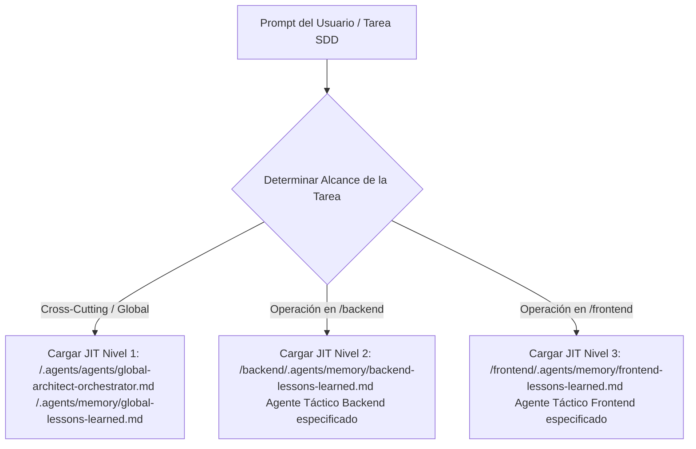
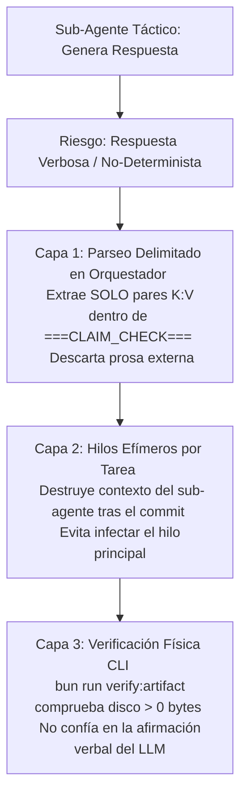

# 01 - Principios Arquitectónicos y Filosofía de Diseño

> **Módulo:** Arquitectura Agéntica - Fideicomisos Migración  
> **Documento:** 01 de 04  
> **Propósito:** Definir las reglas fundamentales, restricciones deterministas y protocolos de gestión de contexto que rigen a los agentes del sistema.

---

## 1. Reglas Infranqueables del Sistema Agéntico

### 1.1 Mandato de Cero Alucinación y Determinismo (*Zero Hallucination Mandate*)
- **Prohibición de Invención:** Los agentes tienen estrictamente prohibido inventar librerías, sintaxis, comandos CLI o estructuras de base de datos. Toda herramienta, comando o tecnología utilizada debe figurar explícitamente en los archivos de listas blancas (*whitelists*) ubicados en `.agents/knowledge/tech-stack-whitelist.md`.
- **Validación Física de Manifiestos:** Antes de invocar a cualquier agente táctico extraído de metadatos `[AGENT: nombre-agente]`, el orquestador valida físicamente que el archivo de manifiesto `<nombre-agente>.md` exista en una de las rutas autorizadas:
  - `/.agents/agents/<nombre-agente>.md`
  - `/backend/.agents/agents/<nombre-agente>.md`
  - `/frontend/.agents/agents/<nombre-agente>.md`
  Si el manifiesto no existe, la ejecución se **detiene inmediatamente** bajo una alerta de *Critical Routing Violation*.

### 1.2 Invariante de Inmutabilidad del Esquema Legacy (GeneXus)
- Las tablas heredadas del sistema GeneXus (en PostgreSQL / SQL Server) son **100% de solo lectura en cuanto a DDL y esquema**.
- Está **estrictamente prohibido** proponer migraciones, scripts DDL o modificaciones de columnas sobre tablas GeneXus existentes. Toda integración con tablas legacy se realiza mediante la capa de adaptación (*Anti-Corruption Layer - ACL*) mantenida por el agente `acl-legacy-integration-expert`.

### 1.3 Protocolo "Trade-Off First"
- Antes de escribir o modificar código que impacte múltiples capas o dominios, el orquestador **debe presentar obligatoriamente al menos 2 alternativas arquitectónicas**.
- Para cada alternativa se deben detallar: **Pros, Contras e Implicaciones de Deuda Técnica**.
- El orquestador hace una **pausa obligatoria (Puntual HITL Gate)** y espera la aprobación explícita del desarrollador antes de proceder a la generación de especificaciones o código.

---

## 2. Hidratación Just-In-Time (JIT Lazy Loading)

Para evitar la saturación de contexto (*token bloat*) y garantizar que los agentes mantengan una atención focalizada de alta fidelidad, la hidratación de contexto se realiza en 3 niveles de alcance definidos en `AGENTS.md`:



### Tabla de Carga Perezosa por Ámbito

| Alcance (*Scope*) | Desencadenador (*Trigger*) | Archivos de Contexto Cargados Inmediatamente |
| :--- | :--- | :--- |
| **Global / Cross-Cutting** | Prompt ambiguo, arquitectura global o cross-domain | `/.agents/agents/global-architect-orchestrator.md`<br/>`/.agents/memory/global-lessons-learned.md` |
| **Backend Implementation** | Operaciones dentro de `backend/` | `/backend/.agents/memory/backend-lessons-learned.md`<br/>Agente/Skill Backend relevante |
| **Frontend Implementation**| Operaciones dentro de `frontend/` | `/frontend/.agents/memory/frontend-lessons-learned.md`<br/>Agente/Skill Frontend relevante |

---

## 3. Gestión de Contexto Pass-by-Reference y Patrón Claim-Check

El orquestador principal **nunca** lee el código fuente completo ni los documentos de diseño exhaustivos en su propio contexto de conversación. En su lugar, se aplica el patrón **Pass-by-Reference**:

1. **Persistencia en Disco:** Los sub-agentes escriben la telemetría detallada, las especificaciones de diseño y los logs de ejecución directamente en archivos físicos dentro del directorio `/specs/<change-id>/` (e.g., `phase-1-scout.md`, `backend-design.md`, `backend-tasks.md`).
2. **Payload Delimitado Claim-Check (< 150 Tokens):** Los sub-agentes devuelven únicamente un bloque micro Claim-Check estandarizado:

```yaml
===CLAIM_CHECK_START===
status: "SUCCESS" | "FAILURE"
summary: "<Resumen conciso en 1 oración del trabajo realizado>"
artifact_path: "/specs/<change-id>/artifacts/phase-1-scout.md"
artifact_type: "scout" | "design" | "tasks" | "qa" | "code"
files_manifest: "/specs/<change-id>/artifacts/TASK-001-files.txt"
metrics:
  files_to_touch: 3
  layers_affected: 2
  bounded_contexts: 1
  schema_breaking_changes: 0
  estimated_loc_delta: 45
===CLAIM_CHECK_END===
```

3. **Verificación Mecánica de Artefactos:** El orquestador ejecuta el script `bun run verify:artifact <artifact_path> <artifact_type>` mediante la CLI antes de marcar cualquier casilla de tarea como completada.

---

## 4. Estado Único de la Verdad (Markdown Task Contracts)

Para evitar la desincronización de estado entre hilos de conversación o archivos JSON paralelos, todo el estado de ejecución del pipeline SDD reside directamente en **casillas de verificación Markdown de 2 niveles**:

### Nivel 1: Rastreador Macro de Pipeline (`pipeline-tasks.md`)
Ubicado en `/specs/<change-id>/pipeline-tasks.md`, rastrea las 5 fases macro del proceso:

```markdown
# SDD Pipeline: <change-id> | DCS: 4 | Branch: A | Scope: Full-Stack
- [x] Phase 1: Scout Discovery (`artifacts/phase-1-scout.md`)
- [x] Phase 2: Trade-Offs & HITL Routing Gate (`pipeline-tasks.md`)
- [ ] Phase 3: Scoped Design (`backend-design.md`, `frontend-design.md`)
- [ ] Phase 4: Tactical Implementation & Atomic Commit Loop (`backend-tasks.md`, `frontend-tasks.md`)
- [ ] Phase 5: Verification & Strict HITL Gate (`artifacts/phase-5-qa-report.md`)
```

### Nivel 2: Listas de Tareas Tácticas por Dominio (`backend-tasks.md` / `frontend-tasks.md`)
Creadas por los arquitectos de diseño (`strategic-ddd-architect` / `frontend-ui-architect`) en la Fase 3, especificando IDs secuenciales, enrutamiento a agentes y dependencias DAG:

```markdown
- [ ] [TASK-001] [AGENT: tactical-ddd-modeler] Crear aggregate root PlantillaPrestamo. (Ref: backend-design.md#PlantillaPrestamo)
- [ ] [TASK-002] [AGENT: acl-legacy-integration-expert] [DEPENDS: TASK-001] Mapear repositorio ILoanRepository a tabla GeneXus. (Ref: backend-design.md#ILoanRepository)
```

---

## 5. Mandato de Intervención Humana (HITL Gates)

El sistema agéntico opera bajo un modelo de colaboración estrecha con el desarrollador humano. Existen 3 **Puertas de Control HITL (Human-in-the-Loop Gates)** infranqueables:

1. **Gate 1 - Selección de Branch (Fase 2):** Tras el cálculo del *Deterministic Complexity Score* (DCS), el orquestador presenta la telemetría y propone la rama de ejecución (Branch A o Branch B), **pausando y esperando** la selección del desarrollador.
2. **Gate 2 - Manejo de Errores de Compilación (Fase 4):** Si `git-commit-expert` detecta un fallo de compilación, las tareas dependientes se pausan, los cambios se aíslan en un stash de Git mediante `bun run task:stash isolate <TASK-ID>`, y se presenta el diagnóstico al desarrollador para decidir si corregir manualmente en IDE o re-invocar al agente con el reporte de error.
3. **Gate 3 - Fallo de QA / Verificación (Fase 5):** Si las pruebas de verificación fallan, el orquestador **TIENE ESTRICTAMENTE PROHIBIDO** entrar en un bucle de reintento automático. Se detiene inmediatamente y presenta las opciones de clasificación de falla al desarrollador (*Falla de Código*, *Falla de Diseño*, o *Falla de Aserto de Test*).

---

## 6. Análisis de Riesgos y Trade-Offs del Patrón Claim-Check

### 6.1 El Riesgo del No-Determinismo Intrínseco en LLMs
A diferencia de un compilador o script tradicional, un Modelo de Lenguaje (*LLM*) es un **sistema probabilístico y no-determinista**. Aunque las instrucciones del sistema (*prompts*) exijan explícitamente la emisión única del bloque delimitado `===CLAIM_CHECK_START===` ... `===CLAIM_CHECK_END===` ($< 150$ tokens), existe siempre un riesgo residual de que un agente:
- Incluya prosa conversacional antes o después del bloque.
- Intente volcar diffs de código o fragmentos de texto en lugar de limitar la respuesta a metadatos.
- Omita algún atributo obligatorio en el bloque de Claim-Check.

### 6.2 Estrategia de Compensación y Mitigación de Riesgo

Para contrarrestar la naturaleza probabilística de la IA y convertir el proceso en un flujo robusto, la arquitectura aplica **tres capas mecánicas de mitigación**:



1. **Parseo Estricto de Delimitadores (*Payload Extraction*):** El orquestador no consume el texto completo emitido por el sub-agente. Utiliza expresiones regulares estrictas para extraer **exclusivamente** el bloque delimitado entre `===CLAIM_CHECK_START===` y `===CLAIM_CHECK_END===`. Todo texto narrativo o explicativo fuera de dichos marcadores es **descartado automáticamente**, aislando el contexto del orquestador.
2. **Aislamiento por Hilos Efímeros (*Task-Scoped Threads*):** Cada tarea táctica de la Fase 4 se ejecuta en un hilo de sub-agente independiente y de vida corta. Si un sub-agente emite verbosidad no deseada, dicha sobrecarga de tokens se extingue al finalizar la tarea y no contamina el hilo principal del orquestador ni las tareas subsecuentes.
3. **Verificación Mecánica Externa (*Artifact Verification*):** El orquestador no confía en la afirmación verbal del sub-agente (*"Ya creé la especificación"*). Ejecuta mecánicamente el script CLI `bun run verify:artifact <path> <type>` para validar en el sistema de archivos que el artefeacto físico existe y contiene datos reales ($> 0$ bytes) antes de modificar cualquier casilla de estado.
