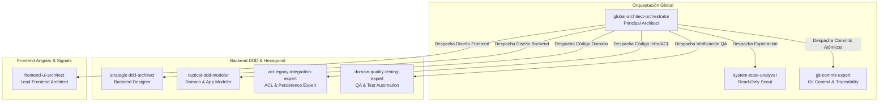

# 02 - Catálogo Completo de Agentes, Skills y Conocimiento

> **Módulo:** Arquitectura Agéntica - Fideicomisos Migración  
> **Documento:** 02 de 04  
> **Propósito:** Registrar formalmente todos los agentes especializados, sus responsabilidades, límites operacionales, habilidades (*skills*) y artefactos de memoria.

---

## 1. Catálogo de Agentes

El sistema cuenta con **8 agentes especializados** organizados jerárquicamente en 3 niveles (Orquestación Global, Especialistas Backend y Especialistas Frontend).

---

### 1.1 Agentes de Orquestación Global

#### 1. `global-architect-orchestrator`
- **Ubicación del Manifiesto:** `/.agents/agents/global-architect-orchestrator.md`
- **Rol:** Arquitecto Principal del Sistema y Gobernador del Pipeline SDD.
- **Fase SDD:** `orchestrator`
- **Herramientas Permitidas:** `invoke_subagent`, `view_file`, `replace_file_content`, `write_to_file`, `run_command`.
- **Skills Asociadas:** `trade-off-analysis`, `ubiquitous-language`.
- **Responsabilidades Principales:**
  - Dirigir el pipeline SDD de 5 fases.
  - Calcular el *Deterministic Complexity Score* (DCS) y proponer la rama de ejecución (Branch A o Branch B).
  - Consultar `bun run next:task` para extraer metadatos de enrutamiento `[AGENT: nombre]`.
  - Validar físicamente la lista blanca de agentes (`agent-name.md`) antes de invocar sub-agentes.
  - Invocar sincrónicamente a `git-commit-expert` tras cada tarea táctica completada.
  - Ejecutar scripts de verificación mecánica de artefactos (`bun run verify:artifact`).
  - Aplicar el aislamiento por Stash (`bun run task:stash`) ante errores de compilación.
- **Límites Infranqueables:**
  - PROHIBIDO escribir código de especificación o implementación directamente en el contexto raíz.
  - PROHIBIDO alterar esquemas de tablas legacy de GeneXus.
  - PROHIBIDO entrar en bucles de reintento automático tras fallas de compilación o test (Obligatorio HITL).

#### 2. `system-state-analyzer`
- **Ubicación del Manifiesto:** `/.agents/agents/system-state-analyzer.md`
- **Rol:** Explorador Táctico de Solo Lectura (*Read-Only Scout*).
- **Fase SDD:** `discovery` (Fase 1)
- **Herramientas Permitidas:** `view_file`, `list_dir`, `grep_search`.
- **Responsabilidades Principales:**
  - Mapear la estructura física de archivos y detectar patrones arquitectónicos vigentes en las rutas asignadas.
  - Inspeccionar firmas de clases, modelos C# y componentes Angular para evaluar impacto.
  - Generar el reporte de telemetría estructural en `/specs/<change-id>/artifacts/phase-1-scout.md`.
  - Devolver el bloque micro Claim-Check con métricas cuantitativas (`files_to_touch`, `layers_affected`, `bounded_contexts`, `schema_breaking_changes`, `estimated_loc_delta`).
- **Límites Infranqueables:**
  - PROHIBIDO escribir, modificar o eliminar archivos.
  - PROHIBIDO ejecutar comandos de terminal o shell.
  - PROHIBIDO explorar rutas que no hayan sido indicadas explícitamente por el orquestador.

#### 3. `git-commit-expert`
- **Ubicación del Manifiesto:** `/.agents/agents/git-commit-expert.md`
- **Rol:** Experto en Auditoría de Cambios, Verificación de Compilación y Trazabilidad Git.
- **Fase SDD:** `execution` (Fase 4)
- **Herramientas Permitidas:** `run_command`.
- **Responsabilidades Principales:**
  - Adquirir el manifiesto de archivos modificados por la tarea táctica (`TASK-XXX-files.txt`).
  - Ejecutar `git add` únicamente sobre los archivos declarados en el manifiesto.
  - Auditar que las líneas modificadas no superen el límite (~400-450 LOC por tarea).
  - Verificar la compilación por capa (`dotnet build backend/FideicomisosBack.sln` o `npm run build --prefix frontend/fideicomisos-web`).
  - Generar y ejecutar el commit convencional estricto en **Español** (`tipo(capa/componente): resumen claro`).
  - Devolver el hash del commit generado (`commit_hash`) al orquestador.
- **Límites Infranqueables:**
  - PROHIBIDO modificar archivos de código fuente.
  - PROHIBIDO realizar commits si la compilación falla (`status: FAILURE_COMPILATION_ERROR`).
  - PROHIBIDO generar mensajes de commit en inglés.

---

### 1.2 Agentes Especialistas Backend (.NET 9 / DDD / Hexagonal)

#### 4. `strategic-ddd-architect`
- **Ubicación del Manifiesto:** `/backend/.agents/agents/strategic-ddd-architect.md`
- **Rol:** Diseñador del Sistema Backend.
- **Fase SDD:** `spec-design` (Fase 3)
- **Herramientas Permitidas:** `view_file`, `replace_file_content`, `write_to_file`.
- **Skills Asociadas:** `hexagonal-clean-architecture`, `ddd-technical-patterns`, `cqrs-application-handlers`.
- **Responsabilidades Principales:**
  - Leer el `README.md` del *Bounded Context* objetivo antes de diseñar.
  - Elaborar la especificación técnica backend (`backend-design.md`) bajo la **Regla de Cero Narrativa** (solo código C#, interfaces y anclas `## Anchor`).
  - Construir la matriz de tareas tácticas (`backend-tasks.md`) asignando metadatos `[TASK-001]`, `[AGENT: ...]` y dependencias DAG `[DEPENDS: ...]`.
- **Límites Infranqueables:** PROHIBIDO escribir código de implementación `.cs` o proponer modificaciones DDL en esquemas GeneXus.

#### 5. `tactical-ddd-modeler`
- **Ubicación del Manifiesto:** `/backend/.agents/agents/tactical-ddd-modeler.md`
- **Rol:** Modelo Táctico de Dominio y Aplicación.
- **Fase SDD:** `domain-model` (Fase 4)
- **Herramientas Permitidas:** `view_file`, `replace_file_content`, `write_to_file`, `run_command`.
- **Skills Asociadas:** `ddd-technical-patterns`, `ubiquitous-language`, `hexagonal-clean-architecture`.
- **Responsabilidades Principales:**
  - Modelar Aggregates Roots, Entidades ricas, Value Objects inmutables y Eventos de Dominio en C#.
  - Encapsular invariantes de negocio mediante *Design by Contract* (constructores privados y métodos de fábrica).
  - Implementar Handlers CQRS (MediatR/C#).
- **Límites Infranqueables:** PROHIBIDO escribir consultas SQL, configuraciones EF Core directas o exponer *setters* públicos en entidades.

#### 6. `acl-legacy-integration-expert`
- **Ubicación del Manifiesto:** `/backend/.agents/agents/acl-legacy-integration-expert.md`
- **Rol:** Experto en Infraestructura, Mapeos de Persistencia y Capa Anti-Corrupción.
- **Fase SDD:** `infrastructure-acl` (Fase 4)
- **Herramientas Permitidas:** `view_file`, `replace_file_content`, `write_to_file`, `run_command`.
- **Skills Asociadas:** `hexagonal-clean-architecture`, `ddd-technical-patterns`.
- **Responsabilidades Principales:**
  - Implementar adaptadores de persistencia EF Core (Repositories, Unit of Work).
  - Mapear tablas legacy GeneXus mediante la Capa Anti-Corrupción (ACL) garantizando la inmutabilidad del esquema base.
  - Configurar clientes HTTP e integraciones externas.

#### 7. `domain-quality-testing-expert`
- **Ubicación del Manifiesto:** `/backend/.agents/agents/domain-quality-testing-expert.md`
- **Rol:** Experto en Automatización de Pruebas y Aseguramiento de Calidad de Dominio.
- **Fase SDD:** `quality-assurance` (Fase 5)
- **Herramientas Permitidas:** `view_file`, `replace_file_content`, `write_to_file`, `run_command`.
- **Skills Asociadas:** `dotnet-testing-strategy`.
- **Responsabilidades Principales:**
  - Escribir y ejecutar suites de prueba unitaria e integración con xUnit, FluentAssertions, Moq y Testcontainers.
  - Verificar el cumplimiento de invariantes de negocio y emitir el reporte en `/specs/<change-id>/artifacts/phase-5-qa-report.md`.

---

### 1.3 Agentes Especialistas Frontend (Angular 19/22 / Signals / Nx)

#### 8. `frontend-ui-architect`
- **Ubicación del Manifiesto:** `/frontend/.agents/agents/frontend-ui-architect.md`
- **Rol:** Arquitecto y Desarrollador UI Frontend.
- **Fase SDD:** `frontend-impl` (Fases 3 y 4)
- **Herramientas Permitidas:** `view_file`, `replace_file_content`, `write_to_file`, `run_command`.
- **Skills Asociadas:** `angular-nx-reactivity`, `angular22-signal-forms`, `frontend-ui-adapters`, `ubiquitous-language`.
- **Responsabilidades Principales:**
  - Diseñar la especificación frontend (`frontend-design.md`) y matriz de tareas (`frontend-tasks.md`) en Fase 3.
  - Implementar componentes *Smart* (funcionales) y *Dumb* (UI puras) bajo arquitectura Nx Monorepo en Fase 4.
  - Manejar el estado reactivo sin `zone.js` utilizando Angular Signals (`signal`, `computed`, `linkedSignal`, `httpResource`).
- **Límites Infranqueables:** PROHIBIDO utilizar `zone.js`, `BehaviorSubject` para estado local, o librerías de UI no aprobadas en la lista blanca.

---

## 2. Matriz de Skills (Habilidades Técnicas)

Las *Skills* son módulos de conocimiento especializado e instrucciones técnicas inyectadas dinámicamente a los agentes según el ámbito de ejecución:

| Skill | Ámbito | Descripción Técnica |
| :--- | :--- | :--- |
| `trade-off-analysis` | Global | Metodología para evaluar 2+ alternativas (Pros, Contras, Deuda Técnica) antes de codificar. |
| `ubiquitous-language` | Global | Diccionario de términos del dominio de Fideicomisos para consistencia en Backend y Frontend. |
| `hexagonal-clean-architecture` | Backend | Reglas de aislamiento entre Dominio, Aplicación, Infraestructura y WebApi. |
| `ddd-technical-patterns` | Backend | Patrones C# para Aggregates, Value Objects, Domain Events y Smart Enums. |
| `cqrs-application-handlers` | Backend | Patrón CQRS con MediatR, validaciones FluentValidation y DTOs inmutables. |
| `dotnet-testing-strategy` | Backend | Estrategia de pruebas C# (.NET 9) con xUnit, FluentAssertions y Testcontainers. |
| `angular-nx-reactivity` | Frontend | Reactividad Zoneless basada en Signals (`signal`, `computed`, `effect`) en monorepo Nx. |
| `angular22-signal-forms` | Frontend | Formularios reactivos basados en Signals y validaciones reactivas en Angular 22. |
| `frontend-ui-adapters` | Frontend | Adaptadores de datos para transformar DTOs del Backend a modelos del UI. |

---

## 3. Repositorio de Conocimiento y Memoria

Para garantizar la persistencia histórica entre sesiones y compacidades de contexto, el sistema mantiene archivos de conocimiento e historial de lecciones aprendidas:

### Conocimiento del Sistema (`knowledge/`)
- `/.agents/knowledge/active-tenants.md`: Registro de los 10 *tenants* activos (SLP, Zacatecas, SITTEZ, Hospital Central, etc.).
- `/.agents/knowledge/bounded-context-map.md`: Mapa de límites de contextos (Loans, IAM, Homologados, Jubilados, Operaciones).
- `/.agents/knowledge/tech-stack-whitelist.md`: Lista blanca de librerías (.NET 9, Angular 22, Postgres, Bun CLI).
- `/backend/.agents/knowledge/genexus-legacy-invariants.md`: Reglas de inmutabilidad y comportamiento de datos legacy.

### Lecciones Aprendidas (`memory/`)
- `/.agents/memory/global-lessons-learned.md`: Correcciones de reglas de negocio globales acordadas con el desarrollador.
- `/backend/.agents/memory/backend-lessons-learned.md`: Trampas técnicas, edge-cases de C# / EF Core o correcciones pasadas en el backend.
- `/frontend/.agents/memory/frontend-lessons-learned.md`: Lecciones aprendidas en el desarrollo de componentes UI Angular y Signals.
