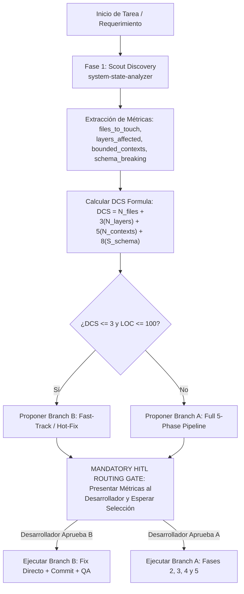
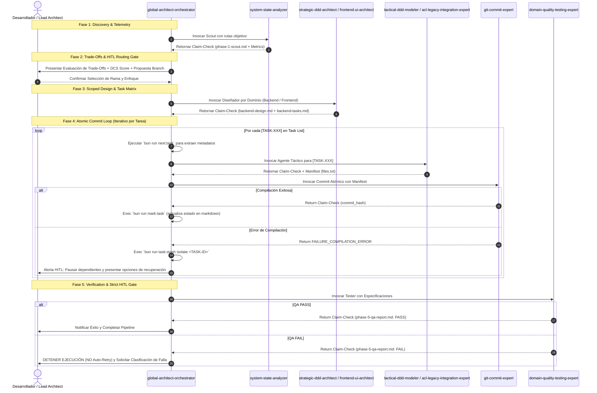
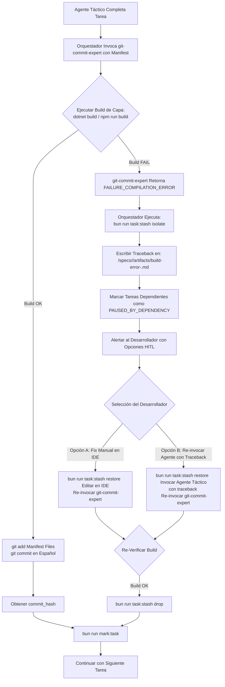

# 03 - Flujos SDD y Protocolos de Ejecución

> **Módulo:** Arquitectura Agéntica - Fideicomisos Migración  
> **Documento:** 03 de 04  
> **Propósito:** Explicar detalladamente el algoritmo de complejidad DCS, el pipeline SDD de 5 fases, el bucle de commits atómicos y el aislamiento de fallas de compilación.

---

## 1. Algoritmo de Enrutamiento por Complejidad Determinista (DCS)

Tras finalizar la Fase 1 (Exploración Táctica), el agente `system-state-analyzer` entrega el bloque de métricas estructurales. Con estos datos, el orquestador aplica la **Fórmula DCS (Deterministic Complexity Score)**:

$$\text{DCS} = N_{\text{archivos}} + (3 \times N_{\text{capas}}) + (5 \times N_{\text{contextos}}) + (8 \times S_{\text{quiebre\_esquema}})$$

Donde:
- $N_{\text{archivos}}$: Cantidad estimada de archivos a modificar (`files_to_touch`).
- $N_{\text{capas}}$: Número de capas arquitectónicas impactadas (`layers_affected`: Dominio, Aplicación, Infraestructura/ACL, UI).
- $N_{\text{contextos}}$: Cantidad de *Bounded Contexts* afectados (`bounded_contexts`).
- $S_{\text{quiebre\_esquema}}$: Indicador binario (1 si rompe compatibilidad DTO/POCO o API, 0 si no).

### Criterio de Selección de Rama (*Branch Routing*)

- **Branch B (Fast-Track / Hot-Fix):** Se propone si $\text{DCS} \le 3$ **y** delta estimado de líneas $\le 100$ LOC. Omite la fase de diseño pesado y pasa directamente del Scout a la implementación guiada.
- **Branch A (Full 5-Phase Pipeline):** Se propone si $\text{DCS} > 3$ **o** delta estimado de líneas $> 100$ LOC. Ejecuta el flujo riguroso completo de 5 fases.

> **IMPORTANTE:** La fórmula DCS es estrictamente informativa. El orquestador **TIENE PROHIBIDO** enrutar automáticamente sin confirmación humana. Siempre hace una pausa en el **MANDATORY HITL ROUTING GATE**.

---

## 2. El Pipeline SDD de 5 Fases (Branch A)

---

## 3. Detalles de las 5 Fases SDD

### Fase 1: Scout Discovery (Descubrimiento)
- **Agente:** `system-state-analyzer`
- **Artefacto Producido:** `/specs/<change-id>/artifacts/phase-1-scout.md`
- **Mapeo:** Escaneo de archivos físicos, firmas de métodos, patrones y cuantificación de métricas estructurales.

### Fase 2: Trade-Offs & HITL Routing Gate (Evaluación y Puerta Humana)
- **Agente:** `global-architect-orchestrator` + Desarrollador
- **Artefacto Producido:** `/specs/<change-id>/pipeline-tasks.md`
- **Mapeo:** Presentación de 2+ opciones de diseño con evaluación Pros/Contras. Cálculo del DCS. Pausa obligatoria hasta recibir la confirmación humana.

### Fase 3: Scoped Design (Diseño de Dominio)
- **Agente:** `strategic-ddd-architect` (Backend) / `frontend-ui-architect` (Frontend)
- **Artefactos Producidos:** `/specs/<change-id>/backend-design.md`, `backend-tasks.md`, `frontend-design.md`, `frontend-tasks.md`
- **Mapeo:** Aplicación estricta de la **Regla de Cero Narrativa** (solo interfaces, contratos C#/TypeScript y anclas `## Anchor`). Creación de la lista de tareas tácticas con formato: `- [ ] [TASK-001] [AGENT: nombre-agente] [DEPENDS: TASK-XXX] Instrucción clara (Ref: design.md#Anchor)`.

### Fase 4: Tactical Implementation & Atomic Commit Loop (Implementación Táctica)
- **Agentes Tácticos:** `tactical-ddd-modeler`, `acl-legacy-integration-expert`, `frontend-ui-architect`
- **Agente Commit:** `git-commit-expert`
- **Mapeo:** Por cada tarea pendiente recuperada mediante `bun run next:task`:
  1. El orquestador despacha al agente táctico correspondiente en un **hilo de conversación fresco** ($O(1)$ token context).
  2. El agente táctico genera o modifica el código y produce un manifiesto de archivos afectados (`TASK-XXX-files.txt`).
  3. El orquestador invoca inmediatamente a `git-commit-expert` para validar la compilación por capa y realizar el commit en español.
  4. Si la compilación es exitosa, se ejecuta `bun run mark:task` para marcar la casilla `- [x]` con el hash del commit.

### Fase 5: Verification & Strict HITL Gate (Verificación QA)
- **Agente:** `domain-quality-testing-expert`
- **Artefacto Producido:** `/specs/<change-id>/artifacts/phase-5-qa-report.md`
- **Mapeo:** Ejecución de suites de prueba unitaria e integración. Si la prueba falla, el sistema se detiene **sin bucles de reintento**. El desarrollador clasifica la falla entre:
  - *Falla de Código (Implementation Bug):* Se añade `[TASK-FIX-001]` a la lista de tareas y se re-ejecuta Fase 4 solo para esa tarea.
  - *Falla de Diseño (Design Flaw):* Se regresa a Fase 3 para refactorizar la especificación de diseño.
  - *Falla de Aserto (Test Assertion Error):* Se re-invoca al agente de QA para ajustar las verificaciones de la prueba.

---

## 4. Protocolo de Commit Atómico y Aislamiento de Errores de Compilación (*Stash Guard*)

Para evitar que código roto contamine el repositorio o bloquee el desarrollo paralelo, se aplica el protocolo de aislamiento mediante `bun run task:stash`:

