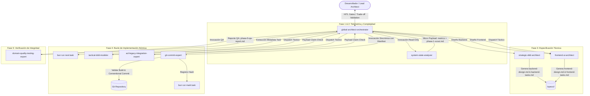

# Documentación Técnica: Arquitectura Agéntica y Pipeline SDD

> **Proyecto:** Fideicomisos Migración (.NET 10 + Nx (Angular 22) + GeneXus Legacy ACL)  
> **Patrón Arquitectónico:** Spec-Driven Development (SDD), Deterministic JIT Routing, Hexagonal/Clean Architecture, Human-in-the-Loop (HITL) Mandate.

---

## Índice de Contenidos

Esta suite de documentación especifica de manera formal y rigurosa la arquitectura agéntica implementada en el monorepo. Diseñada para su entrega en **sidev**, libre de alucinaciones y basada 100% en los artefactos físicos y protocolos del proyecto.

1. [`01-principios-y-filosofia.md`](file:///home/gus/Documents/Repositorios/Gitlab/fideicomisosmigracion/docs/arquitectura-agentica/01-principios-y-filosofia.md)
   - Mandato de Cero Alucinación y Determinismo.
   - Carga Perezosa Multi-Nivel (JIT Hydration).
   - Protocolo "Trade-Off First" y Evaluación Arquitectónica.
   - Invariante de Inmutabilidad de Esquemas Legacy (GeneXus).
   - Gestión de Contexto Pass-by-Reference (Claim Check Protocol).
   - Estado Único de la Verdad mediante Markdown Checkboxes.

2. [`02-catalogo-de-agentes-y-skills.md`](file:///home/gus/Documents/Repositorios/Gitlab/fideicomisosmigracion/docs/arquitectura-agentica/02-catalogo-de-agentes-y-skills.md)
   - Catálogo detallado de Agentes Globales, Backend y Frontend.
   - Roles, herramientas permitidas, límites infranqueables y payload de retorno.
   - Matriz de Skills (Globales, Backend DDD/Hexagonal, Frontend Signals/Nx).
   - Mapeo de Conocimiento (*Knowledge*) y Memoria Persistente (*Lessons Learned*).

3. [`03-flujos-sdd-y-protocolos-de-ejecucion.md`](file:///home/gus/Documents/Repositorios/Gitlab/fideicomisosmigracion/docs/arquitectura-agentica/03-flujos-sdd-y-protocolos-de-ejecucion.md)
   - Fórmula del *Deterministic Complexity Score* (DCS) y enrutamiento a Branch A / Branch B.
   - Flujo detallado del Pipeline SDD de 5 Fases.
   - Ciclo de Commit Atómico y Protocolo `git-commit-expert`.
   - Manejo de Fallas de Compilación (*Stash Guard* y HITL no bloqueante).
   - Diagramas de Arquitectura y Secuencia en **MERMAID**.

4. [`04-herramientas-cli-y-beneficios.md`](file:///home/gus/Documents/Repositorios/Gitlab/fideicomisosmigracion/docs/arquitectura-agentica/04-herramientas-cli-y-beneficios.md)
   - Herramientas CLI automatizadas (`bun run next:task`, `mark:task`, `verify:artifact`, `task:stash`).
   - Beneficios clave: Eficiencia de Tokens $O(1)$, Trazabilidad Atómica en Español, Recuperación Inmediata ante CompACT / Interrupciones.
   - Guía de Integración para **sidev**.

---

## Mapa General de la Arquitectura Agéntica

