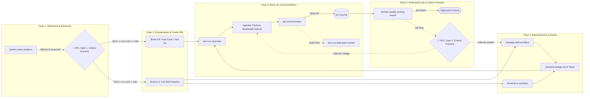

# Sesión 8: Inteligencia Artificial como Copiloto
## El Desarrollador al Mando

<div class="mt-8 flex flex-wrap gap-4">
  <span class="badge badge-blue">.NET 10 / CQRS</span>
  <span class="badge badge-purple">Angular 22 / Signals</span>
  <span class="badge badge-green">Clean Architecture</span>
  <span class="badge badge-amber">Agentic SDD Pipeline</span>
</div>

<div class="mt-12 text-slate-300 text-sm">
  <strong>Proyecto:</strong> Migración de 9 Sistemas Legacy (GeneXus ACL → Arquitectura Hexagonal)<br/>
  <strong>Presentador:</strong> Lead Software Engineer & Principal AI Architect
</div>

---
layout: two-cols-header
---

# El Desarrollador al Mando: Principio Fundamental
## Aceleración de la Migración sin Sacrificar la Arquitectura ni la Calidad

::left::

<div class="card-container card-accent w-full">
  <div class="text-xs uppercase font-bold text-sky-400 mb-2">La Regla de Oro</div>
  <div class="text-base font-semibold text-slate-100 italic mb-2">
    "Comprender los patrones primero; guiar a la IA después."
  </div>
  <hr class="border-slate-700 my-3"/>
  <div class="text-xs text-slate-300 leading-relaxed">
    La Inteligencia Artificial magnifica exponencialmente la velocidad de ejecución y la generación de código base, pero el <strong>desarrollador humano mantiene el 100% de la responsabilidad</strong> sobre la arquitectura, la encapsulación del dominio y los estándares de calidad.
  </div>
</div>

::right::

<div class="card-container card-warning w-full">
  <div class="text-xs uppercase font-bold text-amber-400 mb-2">El Reto de Migración</div>

  - **9 Sistemas Legacy:** Transición de esquemas tabulares GeneXus a Bounded Contexts.
  - **Cero Deuda Técnica Acumulada:** Prohibido copiar anti-patrones legacy a la nueva arquitectura.
  - **Copiloto vs. Piloto Autónomo:** La IA propone, el desarrollador evalúa, refina y valida antes de integrar.

</div>

---
layout: default
---

# Cultura General: De la Inteligencia Artificial al LLM
## Desmitificando los Conceptos Básicos del Procesamiento de Lenguaje

<div class="grid grid-cols-3 gap-6 mt-6">

  <div class="card-container card-accent">
    <div class="badge badge-blue mb-2">1. IA & Machine Learning</div>
    <h3 class="text-xs font-bold text-sky-400 mb-2">De Reglas a Modelos Estadísticos</h3>
    <div class="text-xs text-slate-300 leading-relaxed">
      La Inteligencia Artificial abarca desde sistemas basados en reglas hasta algoritmos de <strong>Machine Learning</strong> que aprenden patrones directamente a partir de datos masivos sin ser programados explícitamente.
    </div>
  </div>

  <div class="card-container card-purple">
    <div class="badge badge-purple mb-2">2. LLMs (Large Language Models)</div>
    <h3 class="text-xs font-bold text-purple-400 mb-2">Arquitectura Transformer</h3>
    <div class="text-xs text-slate-300 leading-relaxed">
      Un LLM es una red neuronal profunda basada en mecanismos de <em>Atención</em> (Transformers) entrenada con petabytes de texto para calcular la probabilidad del lenguaje humano.
    </div>
  </div>

  <div class="card-container card-success">
    <div class="badge badge-green mb-2">3. Tokens & Embeddings</div>
    <h3 class="text-xs font-bold text-emerald-400 mb-2">La Matemática del Texto</h3>
    <div class="text-xs text-slate-300 leading-relaxed">
      El modelo no lee palabras; convierte el texto en <strong>Tokens</strong> (~0.75 palabras) y <strong>Embeddings</strong> (vectores numéricos de 1,536+ dimensiones) para procesar relaciones de significado.
    </div>
  </div>

</div>

<div class="mt-6 p-4 bg-slate-900/80 border border-slate-700 rounded-lg text-xs text-slate-300 flex items-center gap-3">
  <span class="text-xl">💡</span>
  <span><strong>Dato Clave:</strong> Un LLM no "piensa" en conceptos abstractos; procesa números y probabilidades matemáticas a velocidad hiperbólica.</span>
</div>

---
layout: two-cols-header
---

# La Farsa de la "Memoria": Naturaleza Stateless de las APIs de IA
## Por qué el Modelo NO Recuerda Quién Eres ni Qué Dijiste Hace 5 Minutos

::left::

<div class="card-container card-danger w-full">
  <div class="badge badge-amber mb-2">La Ilusión de la Memoria</div>
  <h3 class="text-xs font-semibold text-red-300 mb-2">La Interfaz de Chat vs. La API Real</h3>

  - **El Mito de la Continuidad:** Las aplicaciones web de chat hacen parecer que el modelo "recuerda" la conversación.
  - **La Realidad Técnica:** Los endpoints de las APIs de LLM son **100% Stateless** (HTTP POST sin estado de sesión persistente en los pesos del modelo).
  - **Aislamiento Total:** Cada llamada al API es una ejecución totalmente limpia, aislada e independiente.

</div>

::right::

<div class="card-container card-warning w-full">
  <div class="badge badge-blue mb-2">Mecanismo Técnico</div>
  <h3 class="text-xs font-semibold text-amber-300 mb-2">Payload Acumulativo & Implicaciones</h3>

  - **Re-Envío Completo:** Para mantener contexto, la aplicación cliente DEBE reenviar todo el historial acumulado en cada turno de conversación:
    <div class="font-mono text-[0.68rem] text-slate-400 mt-1 bg-slate-950 p-2 rounded border border-slate-800">
      messages: [<br/>
      &nbsp;&nbsp;{ role: 'system', content: '...' },<br/>
      &nbsp;&nbsp;{ role: 'user', content: 'Msg 1' },<br/>
      &nbsp;&nbsp;{ role: 'assistant', content: 'Resp 1' },<br/>
      &nbsp;&nbsp;{ role: 'user', content: 'Msg 2' }<br/>
      ]
    </div>
  - **Costo Acumulativo:** El consumo de tokens de entrada crece linealmente en cada interacción.

</div>

---
layout: two-cols-header
---

# Fundamentos: La Naturaleza Estocástica de los LLMs
## Predicción de Tokens vs. Ejecución Determinista de Código

::left::

<div class="card-container card-accent w-full">
  <h3 class="text-xs font-semibold text-sky-300 mb-2">¿Cómo Funciona un LLM?</h3>

  - **Modelo Probabilístico:** Selecciona el siguiente token basado en distribuciones de probabilidad ($P(W_n | W_1...W_{n-1})$).
  - **Temperatura y Muestreo:** Introduce variabilidad intencional; el mismo prompt puede producir respuestas diferentes.
  - **Sin Motor de Ejecución Intrínseco:** Un LLM *no ejecuta código mentalmente*; simula patrones de texto aprendidos durante el entrenamiento.

</div>

::right::

<div class="card-container card-danger w-full">
  <h3 class="text-xs font-semibold text-red-300 mb-2">Código Tradicional vs. LLM</h3>
  <table class="w-full text-[0.72rem] text-left text-slate-300 border-collapse mb-3">
    <thead>
      <tr class="border-b border-slate-700 text-sky-400">
        <th class="py-1">Dimensión</th>
        <th class="py-1">Compilador / CLI</th>
        <th class="py-1">LLM (Copiloto)</th>
      </tr>
    </thead>
    <tbody class="divide-y divide-slate-800">
      <tr>
        <td class="py-1.5 font-semibold">Comportamiento</td>
        <td>Determinista (100%)</td>
        <td>Estocástico</td>
      </tr>
      <tr>
        <td class="py-1.5 font-semibold">Entrada igual</td>
        <td>Misma Salida</td>
        <td>Salidas variables</td>
      </tr>
      <tr>
        <td class="py-1.5 font-semibold">Validación</td>
        <td>Sintaxis estática</td>
        <td>Empírica y contrato</td>
      </tr>
    </tbody>
  </table>
  <div class="p-2 bg-red-950/40 border border-red-800/50 rounded text-[0.7rem] text-red-200">
    ⚠️ <strong>Alerta:</strong> La fluidez sintáctica del texto generado por la IA crea una falsa sensación de certeza. ¡Verifica siempre!
  </div>
</div>

---
layout: default
---

# La Ventana de Contexto y el Fenómeno "Lost in the Middle"
## Atención Limitada en Modelos de Lenguaje Masivos

<div class="grid grid-cols-3 gap-6 mt-4">

  <div class="card-container card-accent">
    <div class="badge badge-blue mb-2">1. Capacidad de Contexto</div>
    <h3 class="text-xs font-semibold text-slate-200 mb-2">El Límite Físico de Tokens</h3>
    <div class="text-xs text-slate-300 leading-relaxed">
      Aunque los modelos modernos ofrecen ventanas de 128k a 1M+ de tokens, enviar codebases enteros degrada drásticamente la capacidad de razonamiento.
    </div>
  </div>

  <div class="card-container card-warning">
    <div class="badge badge-amber mb-2">2. Degradación de Atención</div>
    <h3 class="text-xs font-semibold text-slate-200 mb-2">"Lost in the Middle"</h3>
    <div class="text-xs text-slate-300 leading-relaxed">
      Los Transformers prestan alta atención al inicio y al final, pero <strong>ignoran detalles críticos</strong> ubicados en el centro del payload.
    </div>
  </div>

  <div class="card-container card-success">
    <div class="badge badge-green mb-2">3. Estrategia de Mitigación</div>
    <h3 class="text-xs font-semibold text-slate-200 mb-2">Hidratación JIT y Re-Fetch</h3>
    <div class="text-xs text-slate-300 leading-relaxed">
      No alimentes al LLM con todo el proyecto. Pasa referencias cortas (Claim-Check) e hidrata contexto únicamente en la tarea activa.
    </div>
  </div>

</div>

<div class="mt-6 p-4 bg-slate-900/80 border border-slate-700 rounded-lg text-xs text-slate-300 flex items-center gap-3">
  <span class="text-xl">💡</span>
  <span><strong>Regla de Arquitectura:</strong> Menos es más. Un prompt de 2,000 tokens altamente enfocado genera código superior a un prompt saturado de 50,000 tokens.</span>
</div>

---
layout: two-cols-header
---

# Del Prompting Caótico a la Automatización Determinista
## Reemplazando Prompts Volátiles por Flujos Estandarizados

::left::

<div class="card-container card-danger w-full">
  <h3 class="text-xs font-semibold text-red-300 mb-2">El Antipatrón: Chat Web & Prompts Ad-Hoc</h3>

  - Prompts improvisados en chats web individuales.
  - Respuestas inconsistentes que varían por desarrollador.
  - Sin versionamiento en Git ni control de calidad.
  - Fuga de reglas de arquitectura y patrones del proyecto.

</div>

::right::

<div class="card-container card-success w-full">
  <h3 class="text-xs font-semibold text-emerald-300 mb-2">La Solución Enterprise: Pipelines Agénticos</h3>

  - **Scripts & CLIs:** Automatización gestionada mediante comandos (`bun run next:task`).
  - **Plantillas Versadas:** Prompts de agentes y skills almacenados en el repositorio (`.agents/`).
  - **Validación de Contratos:** Linters, compilación estricta y tests automatizados como guardias.

</div>

---
layout: default
---

# Componentes Esenciales del Ecosistema de IA
## Definiendo la Infraestructura de un Sistema Agéntico Enterprise

<div class="grid grid-cols-2 gap-6 mt-4">

  <div class="card-container card-accent">
    <div class="flex items-center gap-2 mb-2">
      <span class="text-lg">🤖</span>
      <h3 class="text-xs font-bold text-sky-400">1. Agente (Agent)</h3>
    </div>
    <div class="text-xs text-slate-300 leading-relaxed">
      Entidad autónoma con rol definido (ej. <code>strategic-ddd-architect</code>), ciclo de razonamiento (Plan → Execute → Verify) y consumo de herramientas.
    </div>
  </div>

  <div class="card-container card-purple">
    <div class="flex items-center gap-2 mb-2">
      <span class="text-lg">🛠️</span>
      <h3 class="text-xs font-bold text-purple-400">2. Skill / Tool</h3>
    </div>
    <div class="text-xs text-slate-300 leading-relaxed">
      Capacidades mecánicas invocables (ej. leer un archivo específico, consultar la lista blanca de dependencias, ejecutar un linter o compilar un proyecto).
    </div>
  </div>

  <div class="card-container card-success">
    <div class="flex items-center gap-2 mb-2">
      <span class="text-lg">📚</span>
      <h3 class="text-xs font-bold text-emerald-400">3. Knowledge (Base de Conocimiento)</h3>
    </div>
    <div class="text-xs text-slate-300 leading-relaxed">
      Documentación técnica, esquemas de BD y guías de arquitectura (ej. <code>tech-stack-whitelist.md</code>) que proveen contexto estático verificado.
    </div>
  </div>

  <div class="card-container card-warning">
    <div class="flex items-center gap-2 mb-2">
      <span class="text-lg">🛡️</span>
      <h3 class="text-xs font-bold text-amber-400">4. Rules / System Instructions</h3>
    </div>
    <div class="text-xs text-slate-300 leading-relaxed">
      Restricciones infranqueables e invariantes de negocio (ej. Mandato de Cero Alucinación, Tablas GeneXus Read-Only) que el modelo DEBE acatar strictly.
    </div>
  </div>

</div>

---
layout: default
---

# Prompts Contextuales Estandarizados
## La Fórmula de 5 Elementos para la Generación de Código Limpio

<div class="p-3 bg-slate-900 border border-sky-500/40 rounded-lg text-center text-xs font-mono text-sky-300 mb-6">
  Prompt Efectivo = Contexto + Rol + Tarea + Restricciones + Ejemplos (Few-Shot)
</div>

<div class="space-y-3 text-xs">
  <v-click>
    <div class="flex items-start gap-3 p-3 bg-slate-800/60 rounded border border-slate-700">
      <span class="badge badge-blue">Contexto</span>
      <span class="text-slate-300">Especificación del sistema legacy, esquema de base de datos actual y tecnologías objetivo (.NET 10 / Angular 22).</span>
    </div>
  </v-click>

  <v-click>
    <div class="flex items-start gap-3 p-3 bg-slate-800/60 rounded border border-slate-700">
      <span class="badge badge-purple">Rol</span>
      <span class="text-slate-300">"Actúa como un Lead Backend Architect experto en DDD, CQRS y MediatR en .NET 10."</span>
    </div>
  </v-click>

  <v-click>
    <div class="flex items-start gap-3 p-3 bg-slate-800/60 rounded border border-slate-700">
      <span class="badge badge-green">Tarea</span>
      <span class="text-slate-300">"Genera el Command Handler para la aprobación de préstamos fideicomitidos respetando inmutabilidad."</span>
    </div>
  </v-click>

  <v-click>
    <div class="flex items-start gap-3 p-3 bg-slate-800/60 rounded border border-slate-700">
      <span class="badge badge-amber">Restricciones</span>
      <span class="text-slate-300">"Prohibido usar EF Core en capa de dominio. Prohibido setters públicos. Retorna siempre <code>Result&lt;T&gt;</code>."</span>
    </div>
  </v-click>

  <v-click>
    <div class="flex items-start gap-3 p-3 bg-slate-800/60 rounded border border-slate-700">
      <span class="badge badge-blue">Few-Shot</span>
      <span class="text-slate-300">Proporciona un fragmento de código de ejemplo que ilustre la estructura de carpetas y nombrado estándar del proyecto.</span>
    </div>
  </v-click>
</div>

---
layout: default
---

# Caso Práctico Backend: CQRS & MediatR Handlers
## Comparativa: Prompt Ad-Hoc vs. Prompt Contextual Estructurado

<div class="space-y-6">

<div class="card-container card-danger w-full">
<div class="flex justify-between items-center mb-2">
<div class="text-xs uppercase font-bold text-red-400">❌ 1. Prompt Ad-Hoc (Genera Código Acoplado)</div>
<span class="badge badge-amber">Antipatrón</span>
</div>
<div class="text-xs text-slate-300 mb-2 italic">Prompt: "Hazme un handler en C# para aprobar préstamos."</div>

```csharp {all}
public class AprobarPrestamoHandler {
    private readonly AppDbContext _db;
    public AprobarPrestamoHandler(AppDbContext db) => _db = db;

    public async Task Handle(AprobarCmd cmd) {
        var p = await _db.Prestamos.FindAsync(cmd.Id);
        p.Estado = "APROBADO"; // Setter abierto, mutación directa de estado!
        await _db.SaveChangesAsync(); // Invocación directa a EF Core dentro del Handler!
    }
}
```
</div>

<div class="card-container card-success w-full">
<div class="flex justify-between items-center mb-2">
<div class="text-xs uppercase font-bold text-emerald-400">✅ 2. Prompt Contextual Estructurado (Clean Architecture)</div>
<span class="badge badge-green">Patrón Correcto</span>
</div>
<div class="text-xs text-slate-300 mb-2 italic">Prompt: Con Rol strategic-ddd-architect, Constraints & Result pattern.</div>

```csharp {all}
public class AprobarPrestamoCommandHandler 
    : IRequestHandler<AprobarPrestamoCommand, Result<Guid>> {
    private readonly ILoanRepository _repo;
    
    public async Task<Result<Guid>> Handle(
        AprobarPrestamoCommand cmd, CancellationToken ct) {
        var loan = await _repo.GetByIdAsync(cmd.LoanId, ct);
        var result = loan.Aprobar(cmd.AprobadorId, cmd.Fecha);
        if (result.IsFailure) return Result.Failure<Guid>(result.Error);
        
        await _repo.UnitOfWork.SaveEntitiesAsync(ct);
        return Result.Success(loan.Id);
    }
}
```
</div>

</div>

---
layout: default
---

# Caso Práctico Dominio: Entidades y Value Objects
## Protegiendo las Reglas de Negocio del Sistema Legacy

<div class="space-y-6">

<div class="card-container card-danger w-full">
<div class="flex justify-between items-center mb-2">
<div class="text-xs uppercase font-bold text-red-400">❌ 1. Dominio Anémico (Alucinación Común)</div>
<span class="badge badge-amber">Sin Invariantes</span>
</div>

```csharp {all}
public class Prestamo {
    public Guid Id { get; set; }
    public decimal Monto { get; set; }
    public string Estado { get; set; } // Mutable libremente desde cualquier lugar!
    public DateTime FechaCreacion { get; set; }
}
```
<div class="text-xs text-red-300 mt-2">
⚠️ <strong>Defecto:</strong> El modelo permite instanciar préstamos en estados inválidos (ej. Monto negativo), violando la encapsulación.
</div>
</div>

<div class="card-container card-success w-full">
<div class="flex justify-between items-center mb-2">
<div class="text-xs uppercase font-bold text-emerald-400">✅ 2. Rich Domain Model (Prompt Estandarizado)</div>
<span class="badge badge-green">Rich Domain</span>
</div>

```csharp {all}
public class Prestamo : AggregateRoot {
    public LoanId Id { get; private set; }
    public Money Monto { get; private set; }
    public LoanStatus Estado { get; private set; }

    private Prestamo() { } // Constructor privado para EF Core

    public static Result<Prestamo> Crear(Money monto) {
        if (monto.Amount <= 0) 
            return Result.Failure<Prestamo>(DomainErrors.MontoInvalido);
        return new Prestamo { Id = LoanId.New(), Monto = monto, Estado = LoanStatus.Borrador };
    }
}
```
</div>

</div>

---
layout: default
---

# Caso Práctico Frontend: Angular 22 & Nx Architecture
## Garantizando Reactividad Fina sin Acoplamiento HTTP

<div class="space-y-6">

<div class="card-container card-danger w-full">
<div class="flex justify-between items-center mb-2">
<div class="text-xs uppercase font-bold text-red-400">❌ 1. Componente Angular Legacy / Acoplado</div>
<span class="badge badge-amber">Acoplado a HTTP</span>
</div>

```ts {all}
@Component({ selector: 'app-loan', template: `...` })
export class LoanComponent implements OnInit {
  loans: any[] = [];
  constructor(private http: HttpClient) {} // HTTP directo en UI Component!
  
  ngOnInit() {
    this.http.get('/api/loans').subscribe(res => {
      this.loans = res as any[]; // Memory leak por falta de unsubscribe & tipo any!
    });
  }
}
```
</div>

<div class="card-container card-success w-full">
<div class="flex justify-between items-center mb-2">
<div class="text-xs uppercase font-bold text-emerald-400">✅ 2. Componente Angular Moderno (Signals & Clean UI)</div>
<span class="badge badge-green">Angular 22 Signals</span>
</div>

```ts {all}
@Component({
  changeDetection: ChangeDetectionStrategy.OnPush,
  template: `@for (loan of loans(); track loan.id) { <loan-card [item]="loan"/> }`
})
export class LoanListComponent {
  private readonly store = inject(LoanStore);
  readonly loans = computed(() => this.store.approvedLoans());
}
```
<div class="text-xs text-emerald-300 mt-2">
✓ Reactividad fina con Signals de Angular 22, OnPush change detection, inyección de Store y cero lógica HTTP en la vista.
</div>
</div>

</div>

---
layout: default
---

# Evaluación Crítica y Detección de Alucinaciones
## Identificando Vicios Comunes en el Código Generado por IA

<div class="space-y-4">

  <v-click>
    <div class="card-container card-danger flex items-start gap-4">
      <div class="text-2xl">🔓</div>
      <div>
        <h3 class="text-xs font-bold text-red-300">1. Violaciones de Encapsulamiento</h3>
        <div class="text-xs text-slate-300 mt-1">
          La IA tiende por defecto a generar miembros <code>public</code> y setters abiertos para satisfacer pruebas rápidamente. <strong>Acción:</strong> Exigir constructores privados y factory methods explícitos.
        </div>
      </div>
    </div>
  </v-click>

  <v-click>
    <div class="card-container card-warning flex items-start gap-4">
      <div class="text-2xl">☣️</div>
      <div>
        <h3 class="text-xs font-bold text-amber-300">2. Fuga de Infraestructura a Dominio</h3>
        <div class="text-xs text-slate-300 mt-1">
          Inclusión desapercibida de namespaces de ORM (<code>using Microsoft.EntityFrameworkCore</code>) o paquetes de cliente HTTP en proyectos de <code>Core.Domain</code>. <strong>Acción:</strong> Validar imports mediante linter de arquitectura.
        </div>
      </div>
    </div>
  </v-click>

  <v-click>
    <div class="card-container card-accent flex items-start gap-4">
      <div class="text-2xl">🔗</div>
      <div>
        <h3 class="text-xs font-bold text-sky-300">3. Acoplamiento de UI Angular a Lógica de Negocio</h3>
        <div class="text-xs text-slate-300 mt-1">
          Componentes de interfaz realizando transformaciones complejas de datos o cálculos financieros directamente en métodos del ciclo de vida. <strong>Acción:</strong> Desacoplar a Presenters o Signal Stores.
        </div>
      </div>
    </div>
  </v-click>

</div>

---
layout: two-cols-header
---

# Estrategias de Validación: El Escudo del Desarrollador
## Combinando Herramientas Estáticas y Pruebas Automatizadas

::left::

<div class="card-container card-accent w-full">
  <div class="badge badge-blue mb-2">Filtro 1: Análisis Estático</div>
  <h3 class="text-xs font-semibold text-slate-200 mb-2">Compilación y Linting Estricto</h3>

  - **Compilador C# / TypeScript:** Flags de nulabilidad estricta (<code>&lt;Nullable&gt;enable&lt;/Nullable&gt;</code>).
  - **NetArchTest:** Reglas automatizadas que impiden compilación si Dominio importa Infraestructura.
  - **ESLint / Nx Boundary Rules:** Control de dependencias entre librerías.

</div>

::right::

<div class="card-container card-success w-full">
  <div class="badge badge-green mb-2">Filtro 2: Pruebas Dinámicas</div>
  <h3 class="text-xs font-semibold text-slate-200 mb-2">TDD & Pruebas de Contrato</h3>

  - **Strict TDD Mode:** Escribir/validar las pruebas unitarias antes o durante la generación del código.
  - **Pruebas ACL:** Garantizan que las llamadas al esquema legacy GeneXus respeten los mappings sin alterar tablas.
  - **Ejecución Local Rápida:** Verificación inmediata mediante CLI antes del commit atómico.

</div>

---
layout: default
---

# Evolución: Hacia una Arquitectura Agéntica
## De la Asistencia Puntual a Pipelines de Migración Estandarizados

<div class="mt-8 flex justify-center items-center gap-6">

  <div class="card-container card-accent text-center w-64 p-4">
    <div class="text-3xl mb-2">💬</div>
    <h3 class="text-xs font-bold text-sky-400">Fase 1: Chat Prompting</h3>
    <div class="text-[0.72rem] text-slate-400 mt-2">
      Asistencia aislada, prompts manuales copiados en el navegador.
    </div>
  </div>

  <div class="text-xl text-sky-400 font-bold">➔</div>

  <div class="card-container card-purple text-center w-64 p-4">
    <div class="text-3xl mb-2">🤖</div>
    <h3 class="text-xs font-bold text-purple-400">Fase 2: Copiloto en IDE</h3>
    <div class="text-[0.72rem] text-slate-400 mt-2">
      Autocompletado de funciones y sugerencias contextuales.
    </div>
  </div>

  <div class="text-xl text-purple-400 font-bold">➔</div>

  <div class="card-container card-success text-center w-64 p-4 border-2 border-emerald-500/60">
    <div class="text-3xl mb-2">⚡</div>
    <h3 class="text-xs font-bold text-emerald-400">Fase 3: SDD Agéntico</h3>
    <div class="text-[0.72rem] text-slate-400 mt-2">
      Agentes orquestados, herramientas CLI, Claim-Check y control HITL.
    </div>
  </div>

</div>

<div class="mt-10 p-4 bg-slate-900/90 border border-emerald-500/40 rounded-lg text-center text-xs text-slate-200">
  🚀 <strong>A continuación:</strong> Analizaremos en detalle la arquitectura agéntica real de nuestro proyecto de migración de <strong>Fideicomisos</strong>.
</div>

---
layout: two-cols-header
---

# Principios Infranqueables del Sistema Agéntico
## Reglas de Integridad, Inmutabilidad Legacy y Gobernanza

::left::

<div class="card-container card-accent w-full">
  <h3 class="text-xs font-semibold text-sky-300 mb-2">1. Zero Hallucination & GeneXus ACL</h3>

  - **Tech Stack Whitelist:** Prohibido inventar librerías o comandos. Todo elemento debe estar en `tech-stack-whitelist.md`.
  - **GeneXus Read-Only Invariant:** Las tablas heredadas GeneXus son 100% de solo lectura. Prohibido ejecutar DDL o scripts de migración sobre ellas. Toda integración se realiza mediante la capa ACL.
  - **Validación Física de Manifiestos:** El orquestador comprueba en disco que el archivo `.md` del agente exista antes de invocarlo.

</div>

::right::

<div class="card-container card-warning w-full">
  <h3 class="text-xs font-semibold text-amber-300 mb-2">2. Trade-Off First & Control HITL</h3>

  - **Protocolo Trade-Off First:** Obligación de presentar al menos 2 alternativas técnicas (Pros, Contras, Deuda Técnica) antes de escribir código.
  - **Sin Reintentos Infinitos:** Prohibido entrar en bucles de auto-reintento tras fallas de compilación o pruebas. Se requiere pausa HITL obligatoria.

</div>

---
layout: two-cols-header
---

# Hidratación JIT (Lazy Loading) de Contexto
## Evitando la Saturación de Tokens (*Token Bloat*) mediante Carga Perezosa por Alcance

::left::

<div class="card-container card-danger w-full">
  <div class="badge badge-amber mb-2">El Problema vs La Solución JIT</div>
  <h3 class="text-xs font-semibold text-red-300 mb-2">Carga Masiva vs. Carga Bajo Demanda</h3>

  - **El Antipatrón de Carga Masiva:** Cargar toda la documentación y reglas del monorepo consume 50,000+ tokens y provoca pérdida de atención (*Lost in the Middle*).
  - **La Solución JIT (Just-In-Time):** Carga perezosa de contexto. El sistema hidrata el archivo de memoria únicamente cuando la tarea toca su ámbito específico.
  - **Resultado:** Máxima fidelidad de atención en conversaciones cortas de alta precisión ($O(1)$ token overhead).

</div>

::right::

<div class="card-container card-accent w-full">
  <div class="badge badge-blue mb-2">Los 3 Niveles de Scope</div>
  <h3 class="text-xs font-semibold text-sky-300 mb-2">Ámbitos de Hidratación en AGENTS.md</h3>
  <div class="space-y-2 text-xs text-slate-300">
    <div class="p-2 bg-slate-900 rounded border border-slate-800">
      <strong class="text-sky-400">Nivel 1 — Global Scope:</strong><br/>
      Prompts ambiguos o de arquitectura general. Carga <code>global-architect-orchestrator.md</code> y <code>global-lessons-learned.md</code>.
    </div>
    <div class="p-2 bg-slate-900 rounded border border-slate-800">
      <strong class="text-emerald-400">Nivel 2 — Backend Scope (<code>/backend</code>):</strong><br/>
      Operaciones en .NET 10. Carga <code>backend-lessons-learned.md</code> + Agente Backend activo (ej. <code>tactical-ddd-modeler</code>).
    </div>
    <div class="p-2 bg-slate-900 rounded border border-slate-800">
      <strong class="text-purple-400">Nivel 3 — Frontend Scope (<code>/frontend</code>):</strong><br/>
      Operaciones en Angular 22. Carga <code>frontend-lessons-learned.md</code> + <code>frontend-ui-architect</code>.
    </div>
  </div>
</div>

---
layout: default
---

# Catálogo de Agentes Especializados del Proyecto
## Estructura Jerárquica de 8 Agentes en 3 Niveles de Dominio

<div class="grid grid-cols-3 gap-6 mt-4">

  <!-- Columna 1: Orquestación Global -->
  <div class="card-container card-accent">
    <div class="badge badge-blue mb-2">Orquestación Global</div>
    <h3 class="text-xs font-bold text-sky-400 mb-2">Gobernanza & Estado</h3>
    <ul class="text-[0.72rem] text-slate-300 space-y-2 list-disc pl-4">
      <li><strong>global-architect-orchestrator:</strong> Gobernador del pipeline SDD, cálculo de DCS y despacho.</li>
      <li><strong>system-state-analyzer:</strong> Explorador táctico de solo lectura (<em>Read-Only Scout</em>) para telemetría.</li>
      <li><strong>git-commit-expert:</strong> Verificador de build por capa, auditor de LOC y creador de commits en Español.</li>
    </ul>
  </div>

  <!-- Columna 2: Especialistas Backend -->
  <div class="card-container card-success">
    <div class="badge badge-green mb-2">Backend (.NET 10 / DDD)</div>
    <h3 class="text-xs font-bold text-emerald-400 mb-2">Dominio & Hexagonal</h3>
    <ul class="text-[0.72rem] text-slate-300 space-y-2 list-disc pl-4">
      <li><strong>strategic-ddd-architect:</strong> Diseñador técnico backend y creador de listas de tareas tácticas.</li>
      <li><strong>tactical-ddd-modeler:</strong> Modelador de Aggregates, Value Objects inmutables y Handlers CQRS.</li>
      <li><strong>acl-legacy-integration-expert:</strong> Constructor de adaptadores EF Core y Capa Anti-Corrupción GeneXus.</li>
      <li><strong>domain-quality-testing-expert:</strong> Automatizador de pruebas xUnit y Testcontainers.</li>
    </ul>
  </div>

  <!-- Columna 3: Especialistas Frontend -->
  <div class="card-container card-purple">
    <div class="badge badge-purple mb-2">Frontend (Angular 22 / Nx)</div>
    <h3 class="text-xs font-bold text-purple-400 mb-2">Signals & UI Adapters</h3>
    <ul class="text-[0.72rem] text-slate-300 space-y-2 list-disc pl-4">
      <li><strong>frontend-ui-architect:</strong> Diseñador UI y creador de componentes zoneless con Signals.</li>
      <li><strong>Arquitectura Nx:</strong> Separación estricta entre componentes Smart (Store/State) y Dumb (UI Pura).</li>
      <li><strong>Zero Zone.js:</strong> Manejo de estado reactivo moderno mediante <code>signal()</code>, <code>computed()</code> y <code>httpResource()</code>.</li>
    </ul>
  </div>

</div>

---
layout: two-cols-header
---

# Matriz de Skills & Gestión de Memoria
## Habilidades Inyectadas Dinámicamente y Archivos de Persistencia

::left::

<div class="card-container card-accent w-full">
  <div class="badge badge-blue mb-2">Matriz de Skills Especializadas</div>
  <h3 class="text-xs font-semibold text-sky-300 mb-2">Habilidades Inyectadas por Ámbito</h3>
  <table class="w-full text-[0.68rem] text-left text-slate-300 border-collapse">
    <thead>
      <tr class="border-b border-slate-700 text-sky-400">
        <th class="py-1">Skill</th>
        <th class="py-1">Ámbito</th>
        <th class="py-1">Propósito</th>
      </tr>
    </thead>
    <tbody class="divide-y divide-slate-800">
      <tr>
        <td class="py-1 font-mono font-bold text-sky-300">trade-off-analysis</td>
        <td>Global</td>
        <td>Evaluación de 2+ opciones de diseño</td>
      </tr>
      <tr>
        <td class="py-1 font-mono font-bold text-emerald-300">hexagonal-architecture</td>
        <td>Backend</td>
        <td>Aislamiento Dominio/Aplicación/Infra</td>
      </tr>
      <tr>
        <td class="py-1 font-mono font-bold text-emerald-300">ddd-patterns</td>
        <td>Backend</td>
        <td>Aggregates, Value Objects & Smart Enums</td>
      </tr>
      <tr>
        <td class="py-1 font-mono font-bold text-purple-300">angular-nx-reactivity</td>
        <td>Frontend</td>
        <td>Signals Zoneless en Monorepo Nx</td>
      </tr>
    </tbody>
  </table>
</div>

::right::

<div class="card-container card-warning w-full">
  <div class="badge badge-amber mb-2">Conocimiento & Memoria Persistente</div>
  <h3 class="text-xs font-semibold text-amber-300 mb-2">Persistencia en <code>knowledge/</code> y <code>memory/</code></h3>

  - **Knowledge (`knowledge/`):** Contexto estático verificado:
    - `active-tenants.md` (SLP, Zacatecas, SITTEZ...).
    - `tech-stack-whitelist.md` (Librerías aprobadas).
    - `bounded-context-map.md` (Límites de dominio).
  - **Memoria (`memory/`):** Lecciones aprendidas por ámbito:
    - `global-lessons-learned.md`
    - `backend-lessons-learned.md`
    - `frontend-lessons-learned.md`

</div>

---
layout: two-cols-header
---

# Algoritmo DCS & Enrutamiento Determinista
## Evaluación de Complejidad Estructural y Selección de Rama (Branch A vs. B)

::left::

<div class="card-container card-accent w-full">
  <div class="badge badge-blue mb-2">Fórmula Matemática DCS</div>
  <h3 class="text-xs font-semibold text-sky-300 mb-2">Deterministic Complexity Score</h3>
  <div class="p-2 bg-slate-900 border border-sky-500/40 rounded text-center text-xs font-mono text-sky-300 mb-3">
    DCS = N_files + 3(N_layers) + 5(N_contexts) + 8(S_schema)
  </div>

  - **N_files:** Archivos estimados a modificar (`files_to_touch`).
  - **N_layers:** Capas impactadas (Dominio, App, Infra/ACL, UI).
  - **N_contexts:** Bounded Contexts afectados.
  - **S_schema:** Indicador binario de quiebre de esquema de API/DTO (1 o 0).

</div>

::right::

<div class="card-container card-warning w-full">
  <div class="badge badge-amber mb-2">Criterio de Ramas & HITL Gate 1</div>
  <h3 class="text-xs font-semibold text-amber-300 mb-2">Selección de Rama de Ejecución</h3>
  <div class="space-y-2 text-xs text-slate-300">
    <div class="p-2 bg-slate-900 rounded border border-emerald-500/30">
      <strong class="text-emerald-400">Branch B (Fast-Track / Hot-Fix):</strong><br/>
      Si $\text{DCS} \le 3$ <strong>y</strong> $\text{LOC} \le 100$. Omite fase de diseño pesado y ejecuta implementación directa + commit + QA.
    </div>
    <div class="p-2 bg-slate-900 rounded border border-amber-500/30">
      <strong class="text-amber-400">Branch A (Full 5-Phase Pipeline):</strong><br/>
      Si $\text{DCS} > 3$ <strong>o</strong> $\text{LOC} > 100$. Ejecuta el pipeline completo de 5 Fases.
    </div>
    <div class="p-2 bg-red-950/40 border border-red-800/50 rounded text-[0.68rem] text-red-200">
      ⛔ <strong>Gate 1 HITL:</strong> El orquestador TIENE PROHIBIDO enrutar automáticamente. Muestra métricas y espera confirmación humana.
    </div>
  </div>
</div>

---
layout: default
---

# Pipeline SDD de 5 Fases
## Flujo Estandarizado de Migración & Puertas HITL



---
layout: two-cols-header
---

# Commit Atómico & Protocolo Stash Guard
## Garantizando la Integridad de la Compilación e Aislamiento de Errores

::left::

<div class="card-container card-accent w-full">
  <div class="badge badge-blue mb-2">Bucle de Commit Atómico</div>
  <h3 class="text-xs font-semibold text-sky-300 mb-2">Proceso por Tarea Táctica (Fase 4)</h3>

  1. **Extracción Metadatos:** `bun run next:task` entrega `[TASK-XXX] [AGENT: ...]`.
  2. **Manifiesto de Archivos:** El agente táctico emite `TASK-XXX-files.txt`.
  3. **Validación de Build:** `git-commit-expert` ejecuta `dotnet build` o `npm run build` antes de staging.
  4. **Commit en Español:** Genera commit convencional `tipo(capa): resumen`.
  5. **Registro Markdown:** `bun run mark:task` actualiza la casilla a `[x]` con el hash del commit.

</div>

::right::

<div class="card-container card-danger w-full">
  <div class="badge badge-amber mb-2">Stash Guard ante Fallas</div>
  <h3 class="text-xs font-semibold text-red-300 mb-2">Aislamiento Mecánico de Errores</h3>

  - **Fallo de Compilación:** Si `git-commit-expert` reporta error de build, la tarea NO se commitea.
  - **Aislamiento Stash:** Se ejecuta `bun run task:stash isolate <TASK-ID>` para enviar los cambios al stash de Git.
  - **Traceback en Disco:** Se escribe el error en `artifacts/build-error-<TASK-ID>.md`.
  - **Alerta HITL Gate 2:** Las tareas dependientes se marcan como `PAUSED` y el desarrollador decide entre reparar manualmente en IDE o re-invocar al agente con el reporte.

</div>

---
layout: two-cols-header
---

# Herramientas CLI & Puertas de Control HITL
## Automatización Mecánica y Control Humano Infranqueable

::left::

<div class="card-container card-accent w-full">
  <h3 class="text-xs font-semibold text-sky-300 mb-2">Comandos CLI Automatizados</h3>

  - **`bun run next:task`** — Extrae la siguiente tarea lista en el DAG.
  - **`bun run mark:task <file> <ID> <hash>`** — Marca casillas en Markdown tras verificación.
  - **`bun run verify:artifact <path> <type>`** — Comprueba físicamente existencia y datos en disco (> 0 bytes).
  - **`bun run task:stash isolate/restore <ID>`** — Aísla o restaura cambios ante fallas de compilación.

</div>

::right::

<div class="card-container card-warning w-full">
  <h3 class="text-xs font-semibold text-amber-300 mb-2">Las 3 Puertas Human-in-the-Loop (HITL)</h3>
  <div class="space-y-2.5 text-[0.7rem] text-slate-300">
    <div class="p-2 bg-slate-900 rounded border border-amber-500/30">
      <strong class="text-amber-400">Gate 1 — Selección de Branch (Fase 2):</strong><br/>
      El desarrollador aprueba el score DCS y la rama de ejecución (A o B).
    </div>
    <div class="p-2 bg-slate-900 rounded border border-amber-500/30">
      <strong class="text-amber-400">Gate 2 — Stash Guard (Fase 4):</strong><br/>
      Ante fallos de compilación, el desarrollador decide la estrategia de reparación.
    </div>
    <div class="p-2 bg-slate-900 rounded border border-amber-500/30">
      <strong class="text-amber-400">Gate 3 — Fallo de QA (Fase 5):</strong><br/>
      Prohibido reintentos automáticos infinitos. Se solicita clasificación humana (Código, Diseño o Aserto).
    </div>
  </div>
</div>

---
layout: center
class: text-center
---

# El Desarrollador al Mando

<div class="max-w-2xl mx-auto my-6 p-6 card-container card-accent">
  <div class="text-lg font-semibold text-sky-300 leading-relaxed">
    "La Inteligencia Artificial magnifica nuestra velocidad de desarrollo,<br/>pero la arquitectura, la calidad y el diseño técnico<br/>son 100% responsabilidad del equipo de ingeniería."
  </div>
</div>

<div class="text-sm text-slate-400 mt-8">
  ¿Preguntas, comentarios o debate sobre la arquitectura agéntica?
</div>

<div class="mt-6 flex justify-center gap-3 text-xs">
  <span class="badge badge-blue">Sesión 8 Completada</span>
  <span class="badge badge-green">Listo para Migración</span>
</div>
